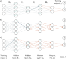
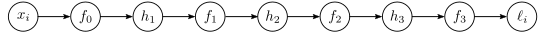
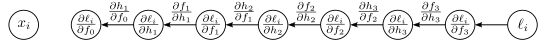
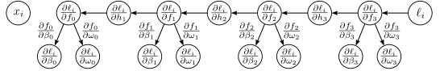
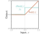
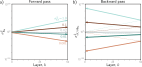
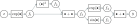

::: {.callout-tip}
## Slides
[Slides](https://docs.google.com/presentation/d/18J7G3N0W3XRP6AX0RHrYfOgiPV_2NHDUMjjXkqI_knc/edit?slide=id.g33a6271ded3_0_0#slide=id.g33a6271ded3_0_0)
::: 

## Problem definitions 

\begin{eqnarray}
  \mathbf{h}_{1} &=& \mathbf{a}[\boldsymbol\beta_{0} +\boldsymbol\Omega_{0}\mathbf{x}]\nonumber \\
  \mathbf{h}_{2} &=& \mathbf{a}[\boldsymbol\beta_{1} +\boldsymbol\Omega_{1}\mathbf{h}_{1}] \nonumber\\
  \mathbf{h}_{3} &=& \mathbf{a}[\boldsymbol\beta_{2} +\boldsymbol\Omega_{2}\mathbf{h}_{2}] \nonumber\\
  \mbox{\bf f}[\mathbf{x},\boldsymbol\phi] &=& \boldsymbol\beta_{3} +\boldsymbol\Omega_{3}\mathbf{h}_{3},
 \end{eqnarray}

\begin{eqnarray}
  L[\boldsymbol\phi]= \sum_{i=1}^{I} \ell_{i}.
 \end{eqnarray}

\begin{eqnarray}\label{eq:train2_sgd}
  \boldsymbol\phi_{t+1}\longleftarrow\boldsymbol\phi_{t} - \alpha \sum_{i\in\mathcal{B}_{t}}\frac{\partial \ell_{i}[\boldsymbol\phi_{t}]}{\partial \boldsymbol\phi},
 \end{eqnarray}

\begin{eqnarray}
  \frac{\partial \ell_{i}}{\partial\boldsymbol\beta_{k}} \quad\quad \mbox{and} \quad\quad \frac{\partial \ell_{i}}{\partial\boldsymbol\Omega_{k}},
 \end{eqnarray}

## Computing derivatives

Backpropagation forward pass. The goal is to compute the derivatives
of the loss ℓ with respect to each of the weights (arrows) and biases (not shown).
In other words, we want to know how a small change to each parameter will affect
the loss. Each weight multiplies the hidden unit at its source and contributes the
result to the hidden unit at its destination. Consequently, the effects of any small
change to the weight will be scaled by the activation of the source hidden unit.
For example, the blue weight is applied to the second hidden unit at layer 1; if
the activation of this unit doubles, then the effect of a small change to the blue
weight will double too. Hence, to compute the derivatives of the weights, we need
to calculate and store the activations at the hidden layers. This is known as the
forward pass since it involves running the network equations sequentially.

Backpropagation backward pass. a) To compute how a change to
a weight feeding into layer h3 (blue arrow) changes the loss, we need to know
how the hidden unit in h3 changes the model output f and how f changes the
loss (orange arrows). b) To compute how a small change to a weight feeding
into h2 (blue arrow) changes the loss, we need to know (i) how the hidden unit
in h2 changes h3, (ii) how h3 changes f , and (iii) how f changes the loss (orange
arrows). c) Similarly, to compute how a small change to a weight feeding into h1
(blue arrow) changes the loss, we need to know how h1 changes h2 and how
these changes propagate through to the loss (orange arrows). The backward pass
first computes derivatives at the end of the network and then works backward to
exploit the inherent redundancy of these computations.

## Toy example

\begin{eqnarray}
  \mbox{f}[x,\boldsymbol\phi] = \beta_3+\omega_3\cdot\cos\Bigl[\beta_2+\omega_2\cdot\exp\bigl[\beta_1+\omega_1\cdot\sin[\beta_0+\omega_0\cdot x]\bigr]\Bigr],
 \end{eqnarray}

\begin{eqnarray}
 \ell_i = (\mbox{f}[x_i,\boldsymbol\phi]-y_i)^2,
 \end{eqnarray}

\begin{eqnarray}
 \frac{\partial \ell_i}{\partial \beta_{0}}, \quad \frac{\partial \ell_i}{\partial \omega_0}, \quad \frac{\partial \ell_i}{\partial \beta_{1}}, \quad \frac{\partial \ell_i}{\partial \omega_1}, \quad
 \frac{\partial \ell_i}{\partial \beta_{2}}, \quad \frac{\partial \ell_i}{\partial \omega_{2}}, \quad \frac{\partial \ell_i}{\partial \beta_{3}}, \quad\mbox{and} \quad \frac{\partial \ell_i}{\partial \omega_{3}}.
 \end{eqnarray}

\begin{eqnarray}\label{eq:train2_complicated_deriv}
 \frac{\partial \ell_i}{\partial \omega_{0}} &=& -2 \left( \beta_3+\omega_3\cdot\cos\Bigl[\beta_2+\omega_2\cdot\exp\bigl[\beta_1+\omega_1\cdot\sin[\beta_0+\omega_0\cdot x_i]\bigr]\Bigr]-y_i\right)\nonumber \\
 &&\hspace{0.5cm}\cdot \omega_1\omega_2\omega_3\cdot x_i\cdot\cos[\beta_0+\omega_0 \cdot x_i]\cdot\exp\Bigl[\beta_1 + \omega_1 \cdot \sin[\beta_0+\omega_0\cdot x_i]\Bigr]\nonumber\\
 && \hspace{1cm}\cdot \sin\biggl[\beta_2+\omega_2\cdot \exp\Bigl[\beta_1 + \omega_1 \cdot \sin[\beta_0+\omega_0\cdot x_i]\Bigr]\biggr].
 \end{eqnarray}

Backpropagation forward pass. We compute and store each of the
intermediate variables in turn until we finally calculate the loss.

\begin{eqnarray}
 f_{0} &=& \beta_{0} + \omega_{0}\cdot x_i\nonumber\\
 h_{1} &=& \sin[f_{0}]\nonumber\\
 f_{1} &=& \beta_{1} + \omega_{1}\cdot h_{1}\nonumber\\
 h_{2} &=& \exp[f_{1}]\nonumber\\
 f_{2} &=& \beta_{2} + \omega_{2} \cdot h_{2}\nonumber\\
 h_{3} &=& \cos[f_{2}]\nonumber\\
 f_{3} &=& \beta_{3} + \omega_{3}\cdot h_{3}\nonumber\\
 \ell_{i} &=& (f_{3}-y_{i})^2.
 \end{eqnarray}

\begin{eqnarray}
 \frac{\partial \ell_i}{\partial f_{3}}, \quad \frac{\partial \ell_i}{\partial h_3}, \quad \frac{\partial \ell_i}{\partial f_2}, \quad
 \frac{\partial \ell_i}{\partial h_2}, \quad \frac{\partial \ell_i}{\partial f_1}, \quad \frac{\partial \ell_i}{\partial h_1}, \quad\mbox{and} \quad \frac{\partial \ell_i}{\partial f_0}.
 \end{eqnarray}

\begin{eqnarray}
 \frac{\partial \ell_i}{\partial f_{3}} = 2(f_3-y_i).
 \end{eqnarray}

\begin{eqnarray}
 \frac{\partial \ell_i}{\partial h_{3}} =\frac{\partial f_{3}}{\partial h_{3}} \frac{\partial \ell_i}{\partial f_{3}} .
 \end{eqnarray}

Backpropagation backward pass #1. We work backward from the end
of the function computing the derivatives ∂ℓi/∂fk and ∂ℓi/∂hk of the loss with
respect to the intermediate quantities. Each derivative is computed from the
previous one by multiplying by terms of the form ∂fk/∂hk or ∂hk/∂fk−1.

\begin{eqnarray}
 \frac{\partial \ell_i}{\partial f_{2}} &=& \frac{\partial h_{3}}{\partial f_{2}}\left(
 \frac{\partial f_{3}}{\partial h_{3}}\frac{\partial \ell_i}{\partial f_{3}} \right)
 \nonumber \\
 \frac{\partial \ell_i}{\partial h_{2}} &=& \frac{\partial f_{2}}{\partial h_{2}}\left(\frac{\partial h_{3}}{\partial f_{2}}\frac{\partial f_{3}}{\partial h_{3}}\frac{\partial \ell_i}{\partial f_{3}}\right)\nonumber \\
 \frac{\partial \ell_i}{\partial f_{1}} &=& \frac{\partial h_{2}}{\partial f_{1}}\left( \frac{\partial f_{2}}{\partial h_{2}}\frac{\partial h_{3}}{\partial f_{2}}\frac{\partial f_{3}}{\partial h_{3}}\frac{\partial \ell_i}{\partial f_{3}} \right)\nonumber \\
 \frac{\partial \ell_i}{\partial h_{1}} &=& \frac{\partial f_{1}}{\partial h_{1}}\left(\frac{\partial h_{2}}{\partial f_{1}} \frac{\partial f_{2}}{\partial h_{2}}\frac{\partial h_{3}}{\partial f_{2}}\frac{\partial f_{3}}{\partial h_{3}}\frac{\partial \ell_i}{\partial f_{3}} \right)\nonumber \\
 \frac{\partial \ell_i}{\partial f_{0}} &=& \frac{\partial h_{1}}{\partial f_{0}}\left(\frac{\partial f_{1}}{\partial h_{1}}\frac{\partial h_{2}}{\partial f_{1}} \frac{\partial f_{2}}{\partial h_{2}}\frac{\partial h_{3}}{\partial f_{2}}\frac{\partial f_{3}}{\partial h_{3}}\frac{\partial \ell_i}{\partial f_{3}} \right).\label{eq:train2_simple_chain}
 \end{eqnarray}

\begin{eqnarray}
 \frac{\partial \ell_i}{\partial \beta_{k}} &=& \frac{\partial f_{k}}{\partial \beta_{k}}\frac{\partial \ell_i}{\partial f_{k}}\nonumber \\
 \frac{\partial \ell_i}{\partial \omega_{k}} &=& \frac{\partial f_{k}}{\partial \omega_{k}}\frac{\partial \ell_i}{\partial f_{k}}.
 \end{eqnarray}

\begin{eqnarray}
 \frac{\partial f_{k}}{\partial \beta_{k}} = 1 \quad\quad\mbox{and}\quad \quad \frac{\partial f_{k}}{\partial \omega_{k}} &=& h_{k}.
 \end{eqnarray}

Backpropagation backward pass #2. Finally, we compute the derivatives
∂ℓi/∂βk and ∂ℓi/∂ωk. Each derivative is computed by multiplying the
term ∂ℓi/∂fk by ∂fk/∂βk or ∂fk/∂ωk as appropriate.

\begin{eqnarray}
 \frac{\partial f_{0}}{\partial \beta_{0}} = 1 \quad\quad\mbox{and}\quad \quad \frac{\partial f_{0}}{\partial \omega_{0}} &=& x_{i}.
 \end{eqnarray}

## Backpropagation algorithm

**Forward Pass**

\begin{eqnarray}
  \mathbf{f}_{0} &=& \boldsymbol\beta_{0} +\boldsymbol\Omega_{0}\mathbf{x}_i\nonumber \\
  \mathbf{h}_{1} &=& \mathbf{a}[\mathbf{f}_{0}]\nonumber \\
  \mathbf{f}_{1} &=& \boldsymbol\beta_{1} +\boldsymbol\Omega_{1}\mathbf{h}_{1}\nonumber \\
  \mathbf{h}_{2} &=& \mathbf{a}[\mathbf{f}_{1}]\nonumber \\
  \mathbf{f}_{2} &=& \boldsymbol\beta_{2} +\boldsymbol\Omega_{2}\mathbf{h}_{2}\nonumber \\
  \mathbf{h}_{3} &=& \mathbf{a}[\mathbf{f}_{2}]\nonumber \\
  \mathbf{f}_{3}&=& \boldsymbol\beta_{3} +\boldsymbol\Omega_{3}\mathbf{h}_{3}\nonumber \\
  \ell_{i} &=& \mbox{l}[\mathbf{f}_{3},y_{i}],
 \end{eqnarray}

Derivative of rectified linear
unit. The rectified linear unit (orange
curve) returns zero when the input is
less than zero and returns the input otherwise.
Its derivative (cyan curve) returns
zero when the input is less than
zero (since the slope here is zero) and
one when the input is greater than zero
(since the slope here is one).

**Backward Pass # 1**

\begin{eqnarray}\label{eq:train2_backward1}
 \frac{\partial \ell_{i}}{\partial \mathbf{f}_{2}}=\frac{\partial \mathbf{h}_{3}}{\partial \mathbf{f}_{2}}\frac{\partial \mathbf{f}_3}{\partial \mathbf{h}_{3}} \frac{\partial \ell_{i}}{\partial \mathbf{f}_3}.
 \end{eqnarray}

\begin{eqnarray}\label{eq:train2_backward2}
 \frac{\partial \ell_{i}}{\partial \mathbf{f}_{1}}&=& \frac{\partial \mathbf{h}_{2}}{\partial \mathbf{f}_{1}}\frac{\partial \mathbf{f}_{2}}{\partial \mathbf{h}_{2}}
 \left(\frac{\partial \mathbf{h}_{3}}{\partial \mathbf{f}_{2}}\frac{\partial \mathbf{f}_3}{\partial \mathbf{h}_{3}} \frac{\partial \ell_{i}}{\partial \mathbf{f}_3}\right)  \\
 \frac{\partial \ell_{i}}{\partial \mathbf{f}_{0}}&=&\frac{\partial \mathbf{h}_{1}}{\partial \mathbf{f}_{0}}\frac{\partial \mathbf{f}_{1}}{\partial \mathbf{h}_{1}}\left(\frac{\partial \mathbf{h}_{2}}{\partial \mathbf{f}_{1}}\frac{\partial \mathbf{f}_{2}}{\partial \mathbf{h}_{2}}
 \frac{\partial \mathbf{h}_{3}}{\partial \mathbf{f}_{2}}\frac{\partial \mathbf{f}_3}{\partial \mathbf{h}_{3}} \frac{\partial \ell_{i}}{\partial \mathbf{f}_3}\right).\label{eq:train2_backward2a}
 \end{eqnarray}

\begin{eqnarray}
  \frac{\partial \mathbf{f}_3}{\partial \mathbf{h}_{3}} = \frac{\partial}{\partial \mathbf{h}_{3}}\left(\boldsymbol\beta_{3} +\boldsymbol\Omega_{3}\mathbf{h}_{3}\right) = \boldsymbol\Omega_{3}^{T}.
  \end{eqnarray}

**Backward Pass # 2**

\begin{eqnarray}
 \frac{\partial \ell_{i}}{\partial \boldsymbol\beta_k} &=& \frac{\partial \mathbf{f}_{k}}{\partial \boldsymbol\beta_k} \frac{\partial \ell_{i}}{\partial \mathbf{f}_{k}} \nonumber\\
 &=& \frac{\partial}{\partial \boldsymbol\beta_k}\left(\boldsymbol\beta_{k} +\boldsymbol\Omega_{k}\mathbf{h}_{k}\right) \frac{\partial \ell_{i}}{\partial \mathbf{f}_{k}} \nonumber \\ 
 &=& \frac{\partial \ell_{i}}{\partial \mathbf{f}_{k}},
 \end{eqnarray}

\begin{eqnarray}
 \frac{\partial \ell_{i}}{\partial \boldsymbol\Omega_k} &=& \frac{\partial \mathbf{f}_{k}}{\partial \boldsymbol\Omega_k} \frac{\partial \ell_{i}}{\partial \mathbf{f}_{k}} \nonumber\\
 &=& \frac{\partial}{\partial \boldsymbol\Omega_k}\left(\boldsymbol\beta_{k} +\boldsymbol\Omega_{k}\mathbf{h}_{k}\right) \frac{\partial \ell_{i}}{\partial \mathbf{f}_{k}} \nonumber \\ 
 &=& \frac{\partial \ell_{i}}{\partial \mathbf{f}_{k}}\mathbf{h}_k^{T}.
 \end{eqnarray}

### Backpropagation algorithm summary

**Forward Pass**

\begin{eqnarray}
  \mathbf{f}_{0} &=& \boldsymbol\beta_{0} +\boldsymbol\Omega_{0}\mathbf{x}_i\nonumber \\
  \mathbf{h}_{k} &=& \mathbf{a}[\mathbf{f}_{k-1}]\hspace{2.76cm} k\in\{1,2,\ldots, K\}\nonumber \\
  \mathbf{f}_{k} &=& \boldsymbol\beta_{k} +\boldsymbol\Omega_{k}\mathbf{h}_{k}.\hspace{2cm} k\in\{1,2,\ldots, K\}
 \end{eqnarray}

**Backward Pass**

\begin{eqnarray}\label{eq:train2_bp_backward_summary}
 \frac{\partial \ell_{i}}{\partial \boldsymbol\beta_k} &=& \frac{\partial \ell_{i}}{\partial \mathbf{f}_k} \hspace{4.1cm} k\in\{K,K-1,\ldots, 1\}\nonumber\\
 \frac{\partial \ell_{i}}{\partial \boldsymbol\Omega_k} &=& \frac{\partial \ell_{i}}{\partial \mathbf{f}_k}\mathbf{h}_{k}^{T}\hspace{3.65cm} k\in\{K,K-1,\ldots, 1\}\nonumber\\
 \frac{\partial \ell_{i}}{\partial \mathbf{f}_{k-1}} &=& \mathbb{I}[\mathbf{f}_{k-1}>0]\odot \left(\boldsymbol\Omega_{k}^{T}\frac{\partial \ell_{i}}{\partial \mathbf{f}_{k}}\right),\hspace{0.82cm} k\in\{K,K-1,\ldots, 1\}
 \end{eqnarray}

\begin{eqnarray}
 \frac{\partial \ell_{i}}{\partial \boldsymbol\beta_0} &=& \frac{\partial \ell_{i}}{\partial \mathbf{f}_0} \nonumber\\
 \frac{\partial \ell_{i}}{\partial \boldsymbol\Omega_0} &=& \frac{\partial \ell_{i}}{\partial \mathbf{f}_0}\mathbf{x}_{i}^{T}.
 \end{eqnarray}

### Algorithmic differentiation

### Extension to arbitrary computational graphs 

## Parameter Initialization

\begin{eqnarray}
 \mathbf{f}_{k} &=& \boldsymbol\beta_{k} +\boldsymbol\Omega_{k}\mathbf{h}_{k}\nonumber\\
 &=& \boldsymbol\beta_{k} +\boldsymbol\Omega_{k}\textbf{a}[\mathbf{f}_{k-1}], 
 \end{eqnarray}

### Initialization for forward pass 

\begin{eqnarray}
  \mathbf{h} &=& \mbox{\bf a}[\mathbf{f}],\nonumber \\
  \mathbf{f}' &=& \boldsymbol\beta +\boldsymbol\Omega\mathbf{h} 
 \end{eqnarray}

\begin{eqnarray}
  \mathbb{E}[f'_{i}] &=& \mathbb{E}\left[\beta_{i} + \sum_{j=1}^{D_h}\Omega_{ij}h_{j}\right]\nonumber \\
  &=& \mathbb{E}\left[\beta_{i}\right] +\sum_{j=1}^{D_h}\mathbb{E}\left[\Omega_{ij}h_{j}\right] \nonumber\\
  &=& \mathbb{E}\left[\beta_{i}\right] +\sum_{j=1}^{D_h}\mathbb{E}\left[\Omega_{ij}\right]\mathbb{E}\left[h_{j}\right] \nonumber\\
  &=& 0 + \sum_{j=1}^{D_h} 0\cdot\mathbb{E}\left[h_{j}\right] = 0,
 \end{eqnarray}

\begin{eqnarray}
  \sigma^{2}_{f'_i} &=& \mathbb{E}[f_{i}^{\prime 2}]-\mathbb{E}[f'_{i}]^{2} \nonumber \\
  &=& \mathbb{E}\left[\left(\beta_{i}+\sum_{j=1}^{D_h}\Omega_{ij}h_{j}\right)^2\right]-0\nonumber\\
  &=& \mathbb{E}\left[\left(\sum_{j=1}^{D_h}\Omega_{ij}h_{j}\right)^2\right]\nonumber\\
  &=& \sum_{j=1}^{D_h}\mathbb{E}\left[\Omega_{ij}^2\right]\mathbb{E}\left[h_{j}^2\right]\nonumber \\
  &=&\sum_{j=1}^{D_h} \sigma_\Omega^2 \mathbb{E}\left[h_{j}^2\right] = \sigma_\Omega^2 \sum_{j=1}^{D_h} \mathbb{E}\left[h_{j}^2\right],
 \end{eqnarray}

\begin{eqnarray}
 \sigma^{2}_{f'_{i}} = \sigma_\Omega^2 \sum_{j=1}^{D_h} \frac{\sigma_{f}^2}{2} = \frac{1}{2}D_{h} \sigma_\Omega^2 \sigma_{f}^2.
 \end{eqnarray}

Weight initialization. Consider a deep network with 50 hidden layers
and Dh = 100 hidden units per layer. The network has a 100-dimensional input x
initialized from a standard normal distribution, a single fixed target y = 0, and
a least squares loss function. The bias vectors βk are initialized to zero, and the
weight matrices Ωk are initialized with a normal distribution with mean zero and
five different variances σ2Ω
∈ {0.001, 0.01, 0.02, 0.1, 1.0}. a) Variance of hidden
unit activations computed in forward pass as a function of the network layer. For
He initialization (σ2Ω
= 2/Dh = 0.02), the variance is stable. However, for larger
values, it increases rapidly, and for smaller values, it decreases rapidly (note
log scale). b) The variance of the gradients in the backward pass (solid lines)
continues this trend; if we initialize with a value larger than 0.02, the magnitude
of the gradients increases rapidly as we pass back through the network. If we
initialize with a value smaller, then the magnitude decreases. These are known
as the exploding gradient and vanishing gradient problems, respectively.

\begin{eqnarray}\label{eq:train2_init_forward}
 \sigma_\Omega^2 = \frac{2}{D_h}, 
 \end{eqnarray}

### Initialization for backward pass

\begin{eqnarray}\label{eq:train2_init_back}
 \sigma_\Omega^2 = \frac{2}{D_{h'}}, 
 \end{eqnarray}

### Initialization for both forward and backward pass 

\begin{eqnarray}
 \sigma_\Omega^2 = \frac{4}{D_{h}+D_{h'}}. 
 \end{eqnarray}

## Example training code 

Computational graph for problem 7.12 and problem 7.13. Adapted
from Domke (2010).

\begin{eqnarray}
 y &=& \phi_{0}+\phi_{1}\mbox{a}\Bigl[\psi_{01} + \psi_{11}\mbox{a}[\theta_{01} + \theta_{11}x] + \psi_{21}\mbox{a}[\theta_{02} + \theta_{12}x]\Bigr]\nonumber \\
 &&\hspace{0.55cm}+\phi_{2}\mbox{a}\Bigl[\psi_{02} + \psi_{12}\mbox{a}[\theta_{01} + \theta_{11}x] + \psi_{22}\mbox{a}[\theta_{02} + \theta_{12}x]\Bigr], 
 \end{eqnarray}

\begin{eqnarray}
  \ell_i = (y_i-\mbox{f}[\mathbf{x}_i,\boldsymbol\phi])^2.
 \end{eqnarray}

\begin{eqnarray}
 \ell_{i} = -(1-y_{i})\log\Bigl[1-\mbox{sig}\bigl[\mbox{f}[\mathbf{x}_i,\boldsymbol\phi]\bigr]\Bigr] - y_{i}\log\Bigl[\mbox{sig}\bigl[\mbox{f}[\mathbf{x}_i,\boldsymbol\phi]\bigr]\Bigr],
 \end{eqnarray}

\begin{eqnarray}\label{eq:train2_logistic}
 \mbox{sig}[z] = \frac{1}{1+\exp[-z]}.
 \end{eqnarray}

\begin{eqnarray}
 \frac{\partial \mathbf{z}}{\partial \mathbf{h}} = \boldsymbol\Omega^{T},
 \end{eqnarray}

\begin{eqnarray}
 \mbox{Heaviside}[z] = \begin{cases} 0 & \quad z <0 \\ 1 & \quad z\geq 0\end{cases},
 \end{eqnarray}

\begin{eqnarray}
 \mbox{rect}[z] = \begin{cases} 0 & \quad z < 0 \\ 1 & \quad 0 \leq z\leq 1 \\ 0 & \quad z > 1\end{cases}.
 \end{eqnarray}

\begin{eqnarray}
     \frac{\partial \ell}{\partial \boldsymbol\Omega} = \frac{\partial \ell}{\partial \mathbf{f}}\mathbf{h}^{T}.
 \end{eqnarray}

\begin{eqnarray}\label{eq:train2_prob_leaky_relu}
 \mbox{a}[z] = \mbox{ReLU}[z] = \begin{cases} \alpha \cdot z & \quad z <0 \\ z & \quad z\geq 0\end{cases},
 \end{eqnarray}

\begin{eqnarray}\label{eq:prob_comp_graph}\index{reverse-mode differentiation}\index{differentiation!reverse mode}\index{backpropagation!on acyclic graph}
  y = \exp\left[\exp[x]+\exp[x]^2\right]+ \sin[\exp[x]+\exp[x]^2].
 \end{eqnarray}

\begin{eqnarray}
 f_{1} &=& \exp[x]\nonumber \\
 f_{2} &=& f_{1}^2\nonumber \\
 f_{3} &=& f_{1}+f_{2}\nonumber \\
 f_{4} &=& \exp[f_{3}]\nonumber \\
 f_{5} &=& \sin[f_{3}]\nonumber \\
 y &=& f_{4}+f_{5}.
 \end{eqnarray}

\begin{eqnarray}
  \frac{\partial y}{\partial f_{5}}, \frac{\partial y}{\partial f_{4}}, \frac{\partial y}{\partial f_{3}},
  \frac{\partial y}{\partial f_{2}}, \frac{\partial y}{\partial f_{1}} \mbox{ and } \frac{\partial y}{\partial x},
 \end{eqnarray}

\begin{eqnarray}
  \frac{\partial f_{1}}{\partial x}, \frac{\partial f_{2}}{\partial x}, \frac{\partial f_{3}}{\partial x}, \frac{\partial f_4}{\partial x},
  \frac{\partial f_{5}}{\partial x}, \mbox{ and } \frac{\partial y}{\partial x},
 \end{eqnarray}

\begin{eqnarray}
 b = \mbox{ReLU}[a] = \begin{cases} 0 & \quad a <0 \\ a& \quad a\geq 0\end{cases},
 \end{eqnarray}