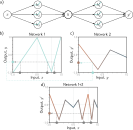
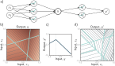
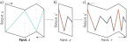
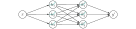
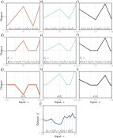
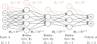
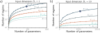
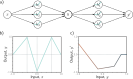
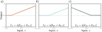

# Deep Neural Networks

::: {.callout-tip}
## Slides
[Slides](https://docs.google.com/presentation/d/1Bk61VR7h6q_lAa02fRCy464I2wyXLJg8nJQ1qKdyFLA/edit?slide=id.g32ea142b459_0_0#slide=id.g32ea142b459_0_0)
::: 

Composing two single-layer networks with three hidden units each. a)
The output y of the first network constitutes the input to the second network. b)
The first network maps inputs x ∈ [−1, 1] to outputs y ∈ [−1, 1] using a function
comprising three linear regions that are chosen so that they alternate the sign
of their slope (fourth linear region is outside range of graph). Multiple inputs x
(gray circles) now map to the same output y (cyan circle). c) The second network
defines a function comprising three linear regions that takes y and returns y
′ (i.e.,
the cyan circle is mapped to the brown circle). d) The combined effect of these
two functions when composed is that (i) three different inputs x are mapped to
any given value of y by the first network and (ii) are processed in the same way by
the second network; the result is that the function defined by the second network
in panel (c) is duplicated three times, variously flipped and rescaled according to
the slope of the regions of panel (b). (Interactive figure)

Composing neural networks with a 2D input. a) The first network
(from figure 3.8) has three hidden units and takes two inputs x1 and x2 and returns
a scalar output y. This is passed into a second network with two hidden units to
produce y
′. b) The first network produces a function consisting of seven linear
regions, one of which is flat. c) The second network defines a function comprising
two linear regions in y ∈ [−1, 1]. d) When these networks are composed, each of
the six non-flat regions from the first network is divided into two new regions by
the second network to create a total of 13 linear regions.

Deep networks as folding input space. a) One way to think about
the first network from figure 4.1 is that it “folds” the input space back on top
of itself. b) The second network applies its function to the folded space. c) The
final output is revealed by “unfolding” again.

Neural network with one input, one output, and two hidden layers, each containing three hidden units.

Computation for the deep network in figure 4.4. a–c) The inputs
to the second hidden layer (i.e., the pre-activations) are three piecewise linear
functions where the “joints” between the linear regions are at the same places
(see figure 3.6). d–f) Each piecewise linear function is clipped to zero by the
ReLU activation function. g–i) These clipped functions are then weighted with
parameters ϕ
′
1, ϕ
′
2, and ϕ
′
3, respectively. j) Finally, the clipped and weighted
functions are summed and an offset ϕ
′
0 that controls the overall height is added.
(Interactive figure)

Matrix notation for network with Di = 3-dimensional input x, Do = 2-
dimensional output y, and K = 3 hidden layers h1, h2, and h3 of dimensions
D1 = 4, D2 = 2, and D3 = 3 respectively. The weights are stored in matrices Ωk
that multiply the activations from the preceding layer to create the pre-activations
at the subsequent layer. For example, the weight matrix Ω1 that computes the
pre-activations at h2 from the activations at h1 has dimension 2×4. It is applied
to the four hidden units in layer one and creates the inputs to the two hidden
units at layer two. The biases are stored in vectors βk and have the dimension
of the layer into which they feed. For example, the bias vector β2 is length three
because layer h3 contains three hidden units.

The maximum number of linear regions for neural networks increases
rapidly with the network depth. a) Network with Di = 1 input. Each curve represents
a fixed number of hidden layers K, as we vary the number of hidden units
D per layer. For a fixed parameter budget (horizontal position), deeper networks
produce more linear regions than shallower ones. A network with K = 5 layers
and D = 10 hidden units per layer has 471 parameters (highlighted point) and
can produce 161,051 regions. b) Network with Di = 10 inputs. Each subsequent
point along a curve represents ten hidden units. Here, a model with K = 5 layers
and D = 50 hidden units per layer has 10,801 parameters (highlighted point) and
can create more than 1040 linear regions.

Composition of two networks for problem 4.1. a) The output y of the
first network becomes the input to the second. b) The first network computes
this function with output values y ∈ [−1, 1]. c) The second network computes
this function on the input range y ∈ [−1, 1].

Hidden unit activations for problem 4.8. a) First hidden unit has a
joint at position x = 1/6 and a slope of one in the active region. b) Second hidden
unit has a joint at position x = 2/6 and a slope of one in the active region. c)
Third hidden unit has a joint at position x = 4/6 and a slope of minus one in the
active region.