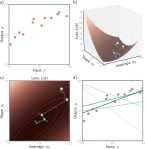
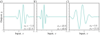
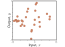
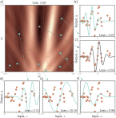
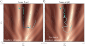
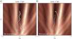
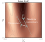
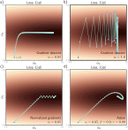
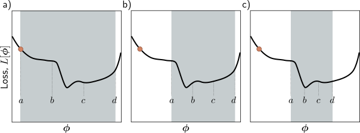
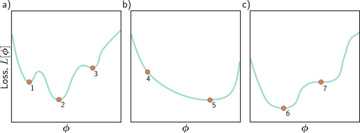

# Gradient Descent

::: {.callout-tip}
## Slides
[Slides](https://docs.google.com/presentation/d/1w5PoGsG-RurZ3QpOfFATrXx5ocZJ6e5JKWoIL05Fydk/edit?slide=id.g3345ec7eb95_0_2#slide=id.g3345ec7eb95_0_2)
::: 

Gradient descent for the linear regression model. a) Training set of I =
12 input/output pairs {xi, yi}. b) Loss function showing iterations of gradient
descent. We start at point 0 and move in the steepest downhill direction until
we can improve no further to arrive at point 1. We then repeat this procedure.
We measure the gradient at point 1 and move downhill to point 2 and so on. c)
This can be visualized better as a heatmap, where the brightness represents the
loss. After only four iterations, we are already close to the minimum. d) The
model with the parameters at point 0 (lightest line) describes the data very badly,
but each successive iteration improves the fit. The model with the parameters at
point 4 (darkest line) is already a reasonable description of the training data.

Gabor model. This nonlinear model maps scalar input x to scalar
output y and has parameters ϕ = [ϕ0, ϕ1]T . It describes a sinusoidal function
that decreases in amplitude with distance from its center. Parameter ϕ0 ∈ R
determines the position of the center. As ϕ0 increases, the function moves left.
Parameter ϕ1 ∈ R+ squeezes the function along the x-axis relative to the center.
As ϕ1 increases, the function narrows. a–c) Model with different parameters.
(Interactive figure)

Training data for fitting the
Gabor model. The training dataset contains
28 input/output examples {xi, yi}.
These data were created by uniformly
sampling xi ∈ [−15, 15], passing the
samples through a Gabor model with parameters
ϕ = [0.0, 16.6]T , and adding
normally distributed noise.

Loss function for the Gabor model. a) The loss function is non-convex,
with multiple local minima (cyan circles) in addition to the global minimum (gray
circle). It also contains saddle points where the gradient is locally zero, but the
function increases in one direction and decreases in the other. The blue cross is
an example of a saddle point; the function decreases as we move horizontally in
either direction but increases as we move vertically. b–f) Models associated with
the different minima. In each case, there is no small change that decreases the
loss. Panel (c) shows the global minimum, which has a loss of 0.64. (Interactive
figure)

Gradient descent vs. stochastic gradient descent. a) Gradient descent
with line search. As long as the gradient descent algorithm is initialized in the
right “valley” of the loss function (e.g., points 1 and 3), the parameter estimate
will move steadily toward the global minimum. However, if it is initialized outside
this valley (e.g., point 2), it will descend toward one of the local minima. b)
Stochastic gradient descent adds noise to the optimization process, so it is possible
to escape from the wrong valley (e.g., point 2) and still reach the global minimum.

Alternative view of SGD for the Gabor model with a batch size three.
a) Loss function for the entire training dataset. At each iteration, there is a probability
distribution of possible parameter changes (inset shows samples). These
correspond to different choices of the three batch elements. b) Loss function for
one possible batch. The SGD algorithm moves in the downhill direction on this
function for a distance that is determined by the learning rate and the local gradient
magnitude. The current model (dashed function in inset) changes to better
fit the batch data (solid function). c) A different batch creates a different loss
function and results in a different update. d) For this batch, the algorithm moves
downhill with respect to the batch loss function but in the locally uphill direction
with respect to the global loss function in panel (a). This is how SGD can escape
local minima.

Figure 6.7 Stochastic gradient descent with momentum. a) Regular stochastic
descent takes a very indirect path toward the minimum. b) With a momentum
term, the change at the current step is a weighted combination of the previous
change and the gradient computed from the batch. This smooths out the
trajectory and increases the speed of convergence.

Nesterov accelerated momentum.
The solution has traveled along
the dashed line to arrive at point 1. A
traditional momentum update measures
the gradient at point 1, moves some distance
in this direction to point 2, and
then adds the momentum term from the
previous iteration (i.e., in the same direction
as the dashed line), arriving at
point 3. The Nesterov momentum update
first applies the momentum term
(moving from point 1 to point 4) and
then measures the gradient and applies
an update to arrive at point 5.

Adaptive moment estimation (Adam). a) This loss function changes
quickly in the vertical direction but slowly in the horizontal direction. If we run
full-batch gradient descent with a learning rate that makes good progress in the
vertical direction, then the algorithm takes a long time to reach the final horizontal
position. b) If the learning rate is chosen so that the algorithm makes
good progress in the horizontal direction, it overshoots in the vertical direction
and becomes unstable. c) A straightforward approach is to move a fixed distance
along each axis at each step so that we move downhill in both directions. This is
accomplished by normalizing the gradient magnitude and retaining only the sign.
However, this does not usually converge to the exact minimum but instead oscillates
back and forth around it (here between the last two points). d) The Adam
algorithm uses momentum in both the estimated gradient and the normalization
term, which creates a smoother path.

Line search using the bracketing approach. a) The current solution is
at position a (orange point), and we wish to search the region [a, d] (gray shaded
area). We define two points b, c interior to the search region and evaluate the loss
function at these points. Here L[b] > L[c], so we eliminate the range [a, b]. b) We
now repeat this procedure in the refined search region and find that L[b] < L[c],
so we eliminate the range [c, d]. c) We repeat this process until this minimum is
closely bracketed.

Three 1D loss functions for problem 6.6.

\begin{eqnarray}
 \hat{\boldsymbol\phi} = \mathop{\rm argmin}_{\boldsymbol\phi}\Bigl[L[\boldsymbol\phi]\Bigr].
 \end{eqnarray}

\begin{eqnarray}
  \frac{\partial L}{\partial \boldsymbol\phi} = \begin{bmatrix}\frac{\partial L}{\partial \phi_{0}} \\[5pt] \frac{\partial L}{\partial \phi_{1}}\\ \vdots \\[5pt] \frac{\partial L}{\partial \phi_{N}}\end{bmatrix}.
 \end{eqnarray}

\begin{eqnarray}\label{eq:train_gradient_descent}
  \boldsymbol\phi\longleftarrow\boldsymbol\phi - \alpha \cdot \frac{\partial L}{\partial \boldsymbol\phi},
  \end{eqnarray}

\begin{eqnarray}
  y &=& \mbox{f}[x,\boldsymbol\phi]\nonumber \\
  &=& \phi_{0} + \phi_{1}x.
 \end{eqnarray}

\begin{eqnarray}\label{eq:train_lr_cost_function}
  L[\boldsymbol\phi] \hspace{0.2cm}= \hspace{0.2cm}\sum_{i=1}^{I} \ell_{i} &=& \sum_{i=1}^{I} \left(\mbox{f}[x_i,\boldsymbol\phi]-y_{i}\right)^{2}\nonumber \\
  &=& \sum_{i=1}^{I} \left(\phi_{0}+\phi_{1}x_{i}-y_{i}\right)^{2},
 \end{eqnarray}

\begin{eqnarray}\label{eq:train_linear_deriv1}
  \frac{\partial L}{\partial \boldsymbol\phi} = \frac{\partial}{\partial \boldsymbol\phi}\sum_{i=1}^{I} \ell_{i} = \sum_{i=1}^{I} \frac{\partial \ell_{i}}{\partial \boldsymbol\phi},
 \end{eqnarray}

\begin{eqnarray}\label{eq:train_linear_deriv2}
  \frac{\partial \ell_{i}}{\partial \boldsymbol\phi} = \begin{bmatrix}\frac{\partial \ell_{i}}{\partial \phi_{0}}\\\vspace{-0.2cm}\\\frac{\partial \ell_{i}}{\partial \phi_{1}}\end{bmatrix} = \begin{bmatrix}2(\phi_{0}+\phi_{1}x_{i}-y_{i})\\ \vspace{-0.2cm}\\ 2x_{i}(\phi_{0}+\phi_{1}x_{i}-y_{i})\end{bmatrix}.
 \end{eqnarray}

\begin{eqnarray}\label{eq:train_gabor}
 \mbox{f}[x,\boldsymbol\phi] = \sin[\phi_0 + 0.06\cdot\phi_{1}x]\cdot \exp\left(-\frac{(\phi_0+0.06\cdot\phi_{1}x)^2}{32.0}\right).
 \end{eqnarray}

\begin{eqnarray}
  L[\boldsymbol\phi] = \sum_{i=1}^{I}\left(\mbox{f}[x_{i},\boldsymbol\phi]-y_{i}\right)^2.
 \end{eqnarray}

\begin{eqnarray}\label{eq:train_sgd}
  \boldsymbol\phi_{t+1}\longleftarrow\boldsymbol\phi_{t} - \alpha \cdot \sum_{i\in\mathcal{B}_{t}}\frac{\partial \ell_{i}[\boldsymbol\phi_{t}]}{\partial \boldsymbol\phi},
 \end{eqnarray}

\begin{eqnarray}\label{eq:train_momentum}
  \mathbf{m}_{t+1} &\leftarrow& \beta \cdot \mathbf{m}_t + (1-\beta) \sum_{i\in\mathcal{B}_t}\frac{\partial \ell_{i}[\boldsymbol\phi_{t}]}{\partial \boldsymbol\phi}\nonumber \\
  \boldsymbol\phi_{t+1} &\leftarrow&\boldsymbol\phi_{t} - \alpha \cdot \mathbf{m}_{t+1},
 \end{eqnarray}

\begin{eqnarray}\label{eq:train_nesterov}
  \mathbf{m}_{t+1} &\leftarrow& \beta \cdot \mathbf{m}_{t} + (1-\beta) \sum_{i\in\mathcal{B}_{t}}\frac{\partial \ell_{i}[\boldsymbol\phi_{t}-\alpha\beta\cdot\mathbf{m}_{t}]}{\partial \boldsymbol\phi}\nonumber \\
  \boldsymbol\phi_{t+1} &\leftarrow&\boldsymbol\phi_{t} - \alpha\cdot \mathbf{m}_{t+1},
 \end{eqnarray}

\begin{eqnarray}
  \mathbf{m}_{t+1} &\leftarrow& \frac{\partial L[\boldsymbol\phi_{t}]}{\partial \boldsymbol\phi}\nonumber \\
  \mathbf{v}_{t+1} &\leftarrow& \left(\frac{\partial L[\boldsymbol\phi_{t}]}{\partial \boldsymbol\phi}\right)^2.
 \end{eqnarray}

\begin{eqnarray}
 \boldsymbol\phi_{t+1} &\leftarrow & \boldsymbol\phi_{t} - \alpha \cdot \frac{\mathbf{m}_{t+1}}{\sqrt{\mathbf{v}_{t+1}}+\epsilon},
 \end{eqnarray}

\begin{eqnarray}\label{eq:train_adam}
  \mathbf{m}_{t+1} &\leftarrow& \beta \cdot \mathbf{m}_{t} + (1-\beta) \frac{\partial L[\boldsymbol\phi_{t}]}{\partial \boldsymbol\phi}\nonumber \\
  \mathbf{v}_{t+1} &\leftarrow& \gamma \cdot \mathbf{v}_{t} + (1-\gamma) \left(\frac{\partial L[\boldsymbol\phi_{t}]}{\partial \boldsymbol\phi}\right)^2,
 \end{eqnarray}

\begin{eqnarray}\label{eq:train_adam_modify}
 \tilde{\mathbf{m}}_{t+1} &\leftarrow & \frac{\mathbf{m}_{t+1}}{1-\beta^{t+1}}\nonumber \\
 \tilde{\mathbf{v}}_{t+1} &\leftarrow & \frac{\mathbf{v}_{t+1}}{1-\gamma^{t+1}}.
 \end{eqnarray}

\begin{eqnarray}
 \boldsymbol\phi_{t+1} &\leftarrow & \boldsymbol\phi_{t} - \alpha\cdot\frac{ \tilde{\mathbf{m}}_{t+1}}{\sqrt{\tilde{\mathbf{v}}_{t+1}}+\epsilon}.
 \end{eqnarray}

\begin{eqnarray}\label{eq:train_adam_final}
  \mathbf{m}_{t+1} &\leftarrow& \beta \cdot \mathbf{m}_{t} + (1-\beta) \sum_{i\in\mathcal{B}_{t}}\frac{\partial \ell_i[\boldsymbol\phi_{t}]}{\partial \boldsymbol\phi}\nonumber \\
  \mathbf{v}_{t+1} &\leftarrow& \gamma \cdot \mathbf{v}_{t} + (1-\gamma) \left(\sum_{i\in\mathcal{B}_{t}}\frac{\partial \ell_i[\boldsymbol\phi_{t}]}{\partial \boldsymbol\phi}\right)^2,
 \end{eqnarray}

\begin{eqnarray}
 \mathbf{H}[\boldsymbol\phi] = \begin{bmatrix} \frac{\partial^{2} L}{\partial\phi_{0}^{2}} & \frac{\partial^{2} L}{\partial\phi_{0}\partial\phi_{1}} &\hdots &\frac{\partial^{2} L}{\partial\phi_{0}\partial\phi_{N}}\\ 
 \frac{\partial^{2} L}{\partial\phi_{1}\partial\phi_{0}} &\frac{\partial^{2} L}{\partial\phi_{1}^{2}} &\hdots&\frac{\partial^{2} L}{\partial\phi_{1}\partial\phi_{N}} \\ \vdots &\vdots & \ddots &\vdots\\ 
 \frac{\partial^{2} L}{\partial\phi_{N}\partial\phi_{0}} &\frac{\partial^{2} L}{\partial\phi_{N}\partial\phi_{1}} &\hdots&\frac{\partial^{2} L}{\partial\phi_{N}^2} \end{bmatrix}.
 \end{eqnarray}

\begin{eqnarray}
 \mathbf{H}[\boldsymbol\phi] = \begin{bmatrix} \frac{\partial^{2} L}{\partial\phi_{0}^{2}} & \frac{\partial^{2} L}{\partial\phi_{0}\partial\phi_{1}}\\ 
 \frac{\partial^{2} L}{\partial\phi_{1}\partial\phi_{0}} &\frac{\partial^{2} L}{\partial\phi_{1}^{2}} \end{bmatrix},
 \end{eqnarray}

\begin{eqnarray}
 Pr(y=1|x) = \mbox{sig}[\phi_{0}+\phi_{1}x],
 \end{eqnarray}

\begin{eqnarray}
  \mbox{sig}[z] = \frac{1}{1+\exp[-z]}.
 \end{eqnarray}

\begin{eqnarray}
 \mbox{f}[x,\boldsymbol\phi]  = \phi_{0}+\phi_{1}\mbox{a}[\theta_{10} + \theta_{11}x]+\phi_{2}\mbox{a}[\theta_{20} + \theta_{21}x]+\phi_{3}\mbox{a}[\theta_{30} + \theta_{31}x].
 \end{eqnarray}