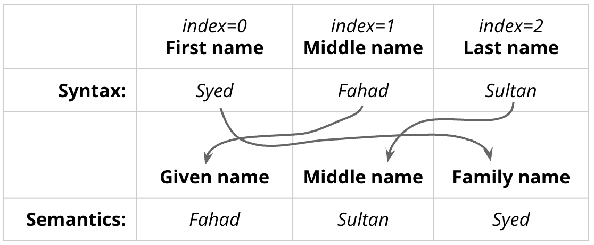
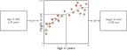
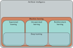
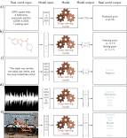

Syed Fahad Sultan سید فہد سلطان  

**Pronunciation**:  <a href="https://en.wikipedia.org/wiki/Sayyid">Saiyyudh</a> <a href="https://en.wikipedia.org/wiki/Fahd">Fahad</a> <a href="https://en.wikipedia.org/wiki/Sultan">Sool-tahn</a>

_Just call me **“Dr. Sultan”**_ (click on the speaker for a short audio clip: [🔈](https://upload.wikimedia.org/wikipedia/commons/c/cd/LL-Q9292_%28aze%29-Azerbaijani_audiorecordings-sultan.wav))

 

 

### How to Reach Me

**Office**: Riley Hall 200-H

**Email**: fahad.sultan@furman.edu

<!-- My office hours this semester are **10 - 11:30 AM** on **Mondays** and **Wednesdays**. -->

I don’t hold fixed office hours, but I’m available for on-demand meetings in real time. If you’d like to guarantee a time, you can schedule a meeting using this link.
[https://calendly.com/ssultan-dpq/15-minute-meeting](https://calendly.com/ssultan-dpq/15-minute-meeting).

<!-- I have an **Open door policy**. I am in my office during work hours most weekdays and my door is only closed if I am in a class or in a meeting. So please drop by.  -->

</img>

## About the Course
 
Course website: **[https://fahadsultan.com/csc372](https://fahadsultan.com/csc372)**

The **[Syllabus](syllabus/index.html)** is available on the course website. In particular, please make sure to read the **[Grading](syllabus/grading.html)**, **[Academic Integrity](syllabus/integrity.html)** and **[Textbook and other Resources](syllabus/textbook.html)** sections carefully.

All of the course content will be posted on this website.

Important announcements will be made on both the course website homepage and in class. 

You are to submit assignments and exams on **[the course Moodle page](https://courses.furman.edu/course/view.php?id=23022)**. I will also upload all of your grades there.

### Mandatory: Asking Questions in Class

Answering questions during class is strictly optional but asking questions is mandatory. You will not be penalized for asking questions, but you will be penalized for not asking questions.

Everything we are going to cover in this class is available online and in textbooks. You can read about it, watch videos about it, and even ask AI to explain it to you. <u><i>The only reason you're mortgaging your future to a lender for the next twenty years is to ask questions and interact with your fellow debtors and the supposed experts paid to pretend they have the answers.</u></i>

To encourage this, I have allocated **5% of your course grade to asking questions in class**. Ways to earn class participation points include:

1. Coming to class and labs regularly
2. Asking questions during class
3. Sharing your thoughts and comments during class discussions

Class participation is somewhat subjective, but I will do my best to be as fair as possible. I will share your overall class participation points with you with each graded exam. 

### Purposeful Pathways 

During the semester, you must attend two events that are designated as Purposeful Pathways events for Computer Science. 

A list of such events will be provided to you, and you may ask for approval of additional events not on the list. You are then required to write a reflection on each event. 

Each reflection must:

* List at the top of document:
    * The name of the event.
    * The date of the event.
    * The date of submission of your reflection.
    * The category of the event (Career Exploration, Professional Preparation, or Networking). When seeking approval of an event not on the pre-approved list, make sure to inquire about the category.
    * State your question or prompt you are answering. (See below for more details.)
* Be 400-500 words in length.
* Be submitted within 7 days of an event on Moodle. No reflections will be accepted after the last day of classes for the semester.
* Follow the guidelines described below.

Successful completion of the Purposeful Pathways requirement includes developing a specific prompt (or question) prior to the event that is clearly stated in the reflection document. An example of a satisfactory prompt geared toward an Employer Engagement event may be “What are common expectations in the positions that are being described and how does my Furman education prepare for that role?” Your reflection should then attempt to address your prompt. 

It is reasonable for a reflection to ask and answer two questions that you define before the talk, but no more than two are allowed. (If you feel like the question(s) you are asking were not answered, ask the speaker: engage!) 

**A reflection is not a retelling of the events that occurred**. Any such ‘retelling’ will receive credit for completing the task towards the graduation requirement (if applicable; see below), but a 0 for the assignment as a course grade.

#### Requirements for Majors 

All Computer Science and Information Technology majors are required to attend and reflect upon a minimum of six Purposeful Pathways activities during their careers.

These activities will be categorized as follows, with a minimum of one attendance required for each category:

* Career Exploration (alumni career panel, guest speaker, connection with alumni mentor, informational interview, taking a career assessment)
* Professional Preparation (senior etiquette seminar, CS/Math career skills workshop, CS Powerpoint night, appointment with a career advisor, resume writing workshop, interview preparation workshop, Career Fair prep workshop, LinkedIn profile development)
* Networking & Employer Engagement (CS summer research and internship showcase, Career Fair, Career Trek, conference attendance, employer or grad school information sessions, company site visits, grad school site visits) 
 Implementation of this requirement will be through standardized, graded requirements in individual courses.  Each student in the following courses will be required to attend and reflect upon two activities:

* All 300-level electives (CSC-372 this semester)
* CSC-475 or CSC-502
* CSC-122

This will prompt IT majors to reach the minimum of six activities, while CS majors will ultimately participate in 10.

### Exams 

There will be **three** exams in the course, including the final. The final exam will be cumulative. Exams constitute **45%** of your course grade.

All exams will be on paper and closed-book. 

### Assignments 

Assignments are an important part of the course and will constitute **15%** of your course grade. Assignments will be posted on the course website and submitted on Moodle.

The questions in exams are going to be very similar to the questions in assignments. So, if you do well on assignments, you will do well on exams.

### Project 

In this course we will use weekly lab sessions to work towards a large language model project. The project is to be completed in teams of 2-3 students. The project will constitute **30%** of your course grade. 

The project will be broken down into several milestones, each of which will be graded. 

The project will be loosely aligned with lecture topics, but might require you to learn new concepts and techniques on your own.

All programming in this course will be done in Python and PyTorch. You are expected to have a working knowledge of Python before the course begins.

### Giant Asterisk * 

<i><u>**Everything is tentative and subject to change**</u></i>

I am a firm believer in flexibility, adaptability and experimentation in teaching. I will do my best to keep the course schedule, grading, and content as consistent as possible, but I reserve the right to make changes if I feel it is in the best interest of the learning experience of the class.

I will keep you informed of any changes to the course schedule, grading, or content.

## Expect lots of Programming and lots of Math! 

_"But wait, I am not a Math Person!"_ you say!  

There is no such thing as a "_Math Person_". I do recognize, however, that **Math Anxiety** is a real thing and is very common. It is a feeling of fear based on a belief that one is not good at math or that math is inherently difficult. 

Please use this course as an opportunity to overcome your Math anxiety!

In this course, the code you write will be mostly math. Most modern _"AI"_ is just that: math, in code.

This presents a unique opportunity for you to overcome your Math anxiety. You will be able to see the math in action, be able to visualize the results and have a conversation with it. 

Trust me, there is a tremendous amount of beauty and joy to be found in mathematics. And if beauty and joy aren't really your thing, then let me also assure you there is a lot of money to be made these days by being good at coding math. Either way, the rewards are well worth the effort! 

## Machine Learning Models 

A machine-learning model can be represented as a function:

$$
\hat{\mathbf{y}}=f_\phi[\mathbf{x}]
$$

where:

- $\mathbf{x}$ is the input,
- $\hat{\mathbf{y}}$ is the model’s prediction,
- $f_\phi$ is the model,
- $\phi$ represents the model’s learned parameters.

Training is the process of finding values of $\phi$ that make the model useful for a particular task.

A machine learning model represents a family of relationships that relate one or more inputs (e.g. age of a child) to one or more outputs (e.g. height of child). 

The particular relationship is chosen using training data, which consists of input/output pairs (orange points). When we train the model, we search through the possible relationships for one that describes the data well. Here, the trained model is the cyan curve and can be used to compute the height for any age.

## Types of Learning 

Machine learning is an area of artificial intelligence that fits mathematical models to observed data.

Machine learning can be broadly categorized into three main types based on the learning signal or feedback available to the learning system. 

These types are: 

1. Supervised learning
2. Unsupervised learning
3. Reinforcement learning

As of August 2026, the cutting-edge methods in all three areas rely on deep learning.

## Supervised Learning
<!-- 
In supervised learning, the training data contain input-output pairs:

$$
\mathcal{D}=\{(\mathbf{x}_i,\mathbf{y}_i)\}_{i=1}^{I}
$$

The model receives $\mathbf{x}_i$ (an observation or a 'row') and produces a prediction $\hat{\mathbf{y}}_i$

$$
\hat{\mathbf{y}}_i=f_\phi[\mathbf{x}_i],
$$

and compares that prediction with the known correct answer $\mathbf{y}_i$.

The model is trained by minimizing a loss function:

$$
\phi^*
=
\arg\min_\phi
\frac{1}{N}\sum_{i=1}^{N}
\mathcal{L}\left(\hat{\mathbf{y}_i},\mathbf{y}_i\right)
$$

For regression, a common loss is mean squared error:

$$
\mathcal{L}(\hat{y},y)=(\hat{y}-y)^2
$$

For classification, a common loss is negative log-likelihood:

$$
\mathcal{L}(\hat{p},y)=-\log \hat{p}(y\mid x)
$$ -->

In supervised learning, the training data consist of input–output pairs:

$$
\mathcal{D}=\left\{(\mathbf{x}_i,\mathbf{y}_i)\right\}_{i=1}^{I},
$$

where $\mathbf{x}_i$ is the input for observation $i$, and $\mathbf{y}_i$ is its known target or label. The total number of observations is $I$. The goal of supervised learning is to learn a function that maps inputs to outputs.

A model with parameters $\boldsymbol{\phi}$ maps each input to a prediction:

$$
\hat{\mathbf{y}}_i=f_{\boldsymbol{\phi}}[\mathbf{x}_i].
$$

The parameters are learned by minimizing the average loss over the training set:

$$
\boldsymbol{\phi}^{*}
=
\arg\min_{\boldsymbol{\phi}}
\frac{1}{I}
\sum_{i=1}^{I}
\mathcal{L}\left(
f_{\boldsymbol{\phi}}[\mathbf{x}_i],
\mathbf{y}_i
\right).
$$

The loss function measures how different a prediction is from the corresponding known target. The appropriate loss depends on whether the task is regression or classification.

### Regression

Regression is used when the target is a continuous numerical quantity, such as temperature, income, or house price. For scalar regression:

$$
y_i\in\mathbb{R},
\qquad
\hat{y}_i=f_{\boldsymbol{\phi}}[\mathbf{x}_i]\in\mathbb{R}.
$$

A common regression loss is squared error:

$$
\mathcal{L}(\hat{y}_i,y_i)
=
(\hat{y}_i-y_i)^2.
$$

Averaging this loss over the training data gives the mean squared error:

$$
\operatorname{MSE}
=
\frac{1}{I}
\sum_{i=1}^{I}
(\hat{y}_i-y_i)^2.
$$

Minimizing MSE encourages predictions to be close to the observed numerical targets and penalizes large errors more heavily than small ones. Under a probabilistic interpretation, minimizing MSE is equivalent to maximum-likelihood estimation when the target is assumed to equal the model prediction plus Gaussian noise:

$$
y_i=f_{\boldsymbol{\phi}}[\mathbf{x}_i]+\varepsilon_i,
\qquad
\varepsilon_i\sim\mathcal{N}(0,\sigma^2).
$$

### Classification

Classification is used when the target belongs to one of a finite set of categories. For a problem with $K$ classes:

$$
y_i\in\{1,\ldots,K\}.
$$

Rather than directly predicting a class, a classification model commonly produces a probability distribution over the possible classes:

$$
\hat{\mathbf{p}}_i
=
f_{\boldsymbol{\phi}}[\mathbf{x}_i],
\qquad
\hat{p}_{ik}
=
P_{\boldsymbol{\phi}}(y_i=k\mid\mathbf{x}_i).
$$

These probabilities satisfy:

$$
\hat{p}_{ik}\geq 0,
\qquad
\sum_{k=1}^{K}\hat{p}_{ik}=1.
$$

The predicted class is usually the class with the highest estimated probability:

$$
\hat{y}_i
=
\arg\max_{k\in\{1,\ldots,K\}}
\hat{p}_{ik}.
$$

A common classification loss is the negative log-likelihood:

$$
\mathcal{L}(\hat{\mathbf{p}}_i,y_i)
=
-\log \hat{p}_{i,y_i}
=
-\log P_{\boldsymbol{\phi}}(y_i\mid\mathbf{x}_i).
$$

Using a one-hot representation $y_{ik}$, where $y_{ik}=1$ if observation $i$ belongs to class $k$ and $0$ otherwise, this can be written as categorical cross-entropy:

$$
\mathcal{L}(\hat{\mathbf{p}}_i,\mathbf{y}_i)
=
-\sum_{k=1}^{K}
y_{ik}\log\hat{p}_{ik}.
$$

For binary classification, with $y_i\in\{0,1\}$ and $\hat{p}_i=P(y_i=1\mid\mathbf{x}_i)$, the binary cross-entropy loss is:

$$
\mathcal{L}(\hat{p}_i,y_i)
=
-\left[
y_i\log\hat{p}_i
+
(1-y_i)\log(1-\hat{p}_i)
\right].
$$

This loss strongly penalizes a model when it assigns a low probability to the correct class. Thus, regression models learn to predict numerical values, whereas classification models learn probabilities over discrete categories.

Examples include:

- Predicting a house price from its characteristics
- Classifying an email as spam or not spam
- Identifying an object in an image
- Predicting whether a student will complete a course

The defining feature of supervised learning is that the desired output $y$ is provided during training.

Regression and classification problems. a)  b) This multivariate regression model takes the structure of a chemical molecule and predicts its freezing and boiling points. c) This binary classification model takes a restaurant review and classifies it as either positive or negative. d) This multiclass classification problem assigns a snippet of audio to one of N genres. e) A second multiclass classification problem in which the model classifies an image according to which of N possible objects it might contain.

### Structured Outputs

Deep Neural networks, a subset of machine learning models, can also be used to predict structured outputs such as sequences, trees, or graphs. For example, a model might take a sentence as input and produce a parse tree as output, or take an image and produce a segmentation map.

Essentially, structured outputs are multipart outputs that have internal structure and relationships between their parts. In other words, these models predict multiple outputs where each output is not independent of the others.

## Unsupervised Learning

In unsupervised learning, the training data contain inputs $\mathbf{x}_i$ but no supplied target outputs $$:

$$
\mathcal{D}=\{x_i\}_{i=1}^{I}
$$

Instead of learning a direct mapping from a given $x$ to a given $y$, the model attempts to discover structure in the data.

### Clustering

For clustering, the model might assign each input to a cluster:

$$
z_i=f_\phi[\mathbf{x}_i]
$$

where $z_i$ is a learned cluster assignment rather than a human-provided label. 

A clustering algorithm like k-means uses the within-cluster variance as a loss function to learn the cluster assignments:

$$
\mathcal{L}({\mu_k}, {z_i}) = \sum_{i=1}^{I} \left\| \mathbf{x}_i - \mu_{z_i} \right\|^2
$$

where $\mu_{z_i}$ is the mean of the cluster to which $\mathbf{x}_i$ is assigned. The model learns to group similar inputs together without any explicit labels.

There the optimal parameters are found by minimizing the loss function:

$$
\phi^*
=
\arg\min_\phi
\sum_{i=1}^{I}
\left\|
\mathbf{x}_i-\mu_{z_i}
\right\|^2
$$

$$
(\boldsymbol{\mu}^*, \mathbf{z}^*)
=
\arg\min_{\boldsymbol{\mu},\mathbf{z}}
\sum_{i=1}^{I}
\left\|
\mathbf{x}_i-\boldsymbol{\mu}_{z_i}
\right\|^2
$$

If $\boldsymbol{\phi} = (\boldsymbol{\mu}_1,\ldots,\boldsymbol{\mu}_K)$ then we can write the optimization problem as:

$$
\boldsymbol{\phi}^*
=
\arg\min_{\boldsymbol{\phi}}
\sum_{i=1}^{I}
\left\|
\mathbf{x}_i-\boldsymbol{\mu}_{z_i(\boldsymbol{\phi})}
\right\|^2
$$

### Dimensionality Reduction

Given data $X \in \mathbb{R}^{n \times D}$, find a low-dimensional representation $Z \in \mathbb{R}^{n \times d}$ (with $d \ll D$) that minimizes some notion of information loss:

$$\min_{Z, \theta} ; \mathcal{L}(X, Z, \theta)$$

where $\theta$ parameterizes the mapping. The key differences across methods are (1) what $\mathcal{L}$ measures and (2) whether it's solved in closed form or iteratively.

In case of PCA, we minimize squared reconstruction error under a linear projection $W \in \mathbb{R}^{D \times d}$ (orthonormal columns):

$$\mathcal{L}(W) = |X - XWW^T|_F^2$$

Optimization: no gradient descent needed — the solution is the top-$d$ eigenvectors of the covariance matrix $X^TX$, equivalently the top-$d$ singular vectors from SVD. It's a closed-form eigenvalue problem, so the "optimizer" is linear algebra, not iteration.

For dimensionality reduction, the model may learn a lower-dimensional representation:

$$
z=f_\phi[\mathbf{x}]
$$

An autoencoder first encodes $x$ and then reconstructs it:

$$
z=f_\phi(x)
$$

$$
\hat{x}=g_\phi(z)
$$

The parameters are learned by minimizing reconstruction error:

$$
(\theta^*,\phi^*)
=
\arg\min_{\theta,\phi}
\frac{1}{N}\sum_{i=1}^{N}
\left\|
x_i-g_\phi(f_\phi(x_i))
\right\|^2
$$

Examples include:

- Grouping customers with similar behavior
- Discovering topics in documents
- Detecting unusual transactions
- Compressing high-dimensional data
- Learning useful representations of images or text

The defining feature of unsupervised learning is that no correct target $y$ is supplied. The model must discover patterns or structure from $x$ alone.

### Generative Models

Generative unsupervised models learn to synthesize new data examples that are statistically indistinguishable from the training data. 

Some generative models explicitly describe the probability distribution over the input data and
here new examples are generated by sampling from this distribution. 

Others merely learn a mechanism to generate new examples without explicitly describing their distribution.

They have been particularly successful
at generating images (think DALL·E, Midjourney, Stable Diffusion), audio (think Jukebox, AudioLM), and text (think ChatGPT, Claude and Gemini).

 
> I was a little nervous before my first lecture at the University of Bath. It seemed like there were
hundreds of students and they looked intimidating. I stepped up to the lectern and was about to speak
when something bizarre happened.

> _Suddenly, the room was filled with a deafening noise, like a giant roar. It was so loud that I
couldn’t hear anything else and I had to cover my ears. I could see the students looking around, con-
fused and frightened. Then, as quickly as it had started, the noise stopped and the room was silent again.
> I stood there for a few moments, trying to make sense of what had just happened. Then I realized that
the students were all staring at me, waiting for me to say something. I tried to think of something witty
> or clever to say, but my mind was blank. So I just said, “Well, that was strange,’ and then I started my
lecture._

Conditional text synthesis. Given an initial body of text (in black), generative models of text can continue the string plausibly by synthesizing the “missing” remaining part of the string. Generated by GPT3 (Brown et al., 2020).

Variation of the human face. The human face contains roughly 42 muscles, so it’s possible to describe most of the variation in images of the same person in the same lighting with just 42 numbers. In general, datasets of images, music, and text can be described by a relatively small number of underlying variables although it is typically more difficult to tie these to particular physical
mechanisms. Images from Dynamic FACES database (Holland et al., 2019).

### Latent Variables 

Some (but not all) generative models exploit the fact that data can be lower dimensional
than the raw number of observed variables suggests. 

For example, the number of valid
and meaningful English sentences is much smaller than the number of strings created by
drawing words at random. 

Similarly, real-world images are a tiny subset of the images that can be created by drawing random red, green, and blue (RGB) values for every pixel. 

This is because images are generated by physical processes. This leads to the idea that we can describe each data example using a smaller number
of underlying latent variables. 

 

 

Here, the role of deep learning is to describe the mapping between these latent variables and the data. 

The latent variables typically have a simple probability distribution by design. By sampling from this distribution and passing the
result through the deep learning model, we can create new samples.

These models lead to new methods for manipulating real data. For example, consider
finding the latent variables that underpin two real examples. We can interpolate between
these examples by interpolating between their latent representations and mapping the
intermediate positions back into the data space.

Image interpolation. In each row the left and right images are real and the three images in between represent a sequence of interpolations created by a generative model. The generative models that underpin these interpolations
have learned that all images can be created by a set of underlying latent variables. By finding these variables for the two real images, interpolating their values, and then using these intermediate variables to create new images, we can generate intermediate results that are both visually plausible and mix the characteristics of the two original images. Top row adapted from Sauer et al. (2022). Bottom row adapted from Ramesh et al. (2022).

Multiple images generated from the caption “A teddy bear on a skateboard in Times Square.” Generated by DALL·E-2 (Ramesh et al., 2022).

## Reinforcement Learning

In reinforcement learning, an agent repeatedly interacts with an environment.

At time $t$, the agent observes a state $s_t$ and uses a policy to select an action:

$$
a_t=f_\phi(s_t)
$$

The environment then returns a reward $r_t$ and a new state $s_{t+1}$:

$$
(s_t,a_t)\longrightarrow (r_t,s_{t+1})
$$

The objective is not simply to predict a known $y$. Instead, the agent learns a policy that maximizes its expected cumulative reward:

$$
\phi^*
=
\arg\max_\phi
\mathbb{E}\left[
\sum_{t=0}^{T}\gamma^t r_t
\right]
$$

where:

- $r_t$ is the reward received at time $t$,
- $\gamma\in[0,1]$ is a discount factor,
- $T$ is the length of the interaction.

The discount factor determines how much the agent values future rewards:

$$
R_t=r_t+\gamma r_{t+1}+\gamma^2r_{t+2}+\cdots
$$

Examples include:

- Teaching a computer to play a game
- Controlling a robot
- Selecting recommendations over time
- Managing traffic signals
- Learning a strategy for sequential decision-making

The defining feature of reinforcement learning is that the model learns through actions and rewards rather than from a collection of correct input-output pairs.

Policy networks for reinforcement learning. One way to incorporate deep neural networks into reinforcement learning is to use them to define a mapping from the state (here position on chessboard) to the actions (possible moves). This mapping is known as a policy.

## Comparison

| Learning type | Available information | Model interpretation | Objective |
|---|---|---|---|
| Supervised | Inputs $x$ and targets $y$ | $\hat{y}=f_\theta[x]$ | Minimize prediction error |
| Unsupervised | Inputs $x$ only | $z=f_\theta[x]$ | Discover structure or representations |
| Reinforcement | States, actions and rewards | $a=f_\theta[s]$ | Maximize cumulative reward |

In summary:

$$
\text{Supervised:}\qquad
x\longrightarrow f_\theta\longrightarrow\hat{y},
\quad \text{compare with }y
$$

$$
\text{Unsupervised:}\qquad
x\longrightarrow f_\theta\longrightarrow
\text{patterns or representations}
$$

$$
\text{Reinforcement:}\qquad
s_t\longrightarrow f_\theta\longrightarrow a_t
\longrightarrow r_t
$$

All three approaches learn a function $f_\theta$, but they differ in the information available during training and in the objective used to learn the parameters.

