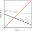
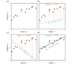

::: {.callout-tip}
## Slides
[Slides](https://docs.google.com/presentation/d/19xKdVzZoa0kbkkm8uI9Hp_NWHs4Nfw8Pg-5ONJf0c0Y/edit?slide=id.p#slide=id.p)
::: 

## Supervised Learning overview 

\begin{eqnarray}
  \mathbf{y} = \mbox{\bf f}[\mathbf{x}].
 \end{eqnarray}

\begin{eqnarray}
  \mathbf{y} = \mbox{\bf f}[\mathbf{x}, \boldsymbol\phi].
\end{eqnarray}

\begin{eqnarray}
  \hat{\boldsymbol\phi} = \mathop{\rm argmin}_{\boldsymbol\phi}\Bigl[L\left[\boldsymbol\phi\right] \Bigr].
\end{eqnarray}




Linear regression model. For a given choice of parameters ϕ= [ϕ0,ϕ1], the model makes a prediction for the out-
put (y-axis) based on the input (x-axis).

Different choices for the y-intercept ϕ0 and the slope ϕ1 change these predictions (cyan, orange, and gray lines). The linear regression model (equation 2.4) defines a family of input/output relations (lines) and the parameters determine the member of the family (the particular line). (Interactive figure)

<br/><br/>

```python
# Math library
import numpy as np
# Plotting library
import matplotlib.pyplot as plt

# Create some input / output data
x = np.array([0.03, 0.19, 0.34, 0.46, 0.78, 0.81, 1.08, 1.18, 1.39, 1.60, 1.65, 1.90])
y = np.array([0.67, 0.85, 1.05, 1.0, 1.40, 1.5, 1.3, 1.54, 1.55, 1.68, 1.73, 1.6 ])

```

## Linear regression example 

### 1D linear regression model


\begin{eqnarray}\label{eq:sl_linear_regression}
  y &=& \mbox{f}[x,\boldsymbol\phi]\nonumber \\
  &=&\phi_{0}+\phi_{1}x.
\end{eqnarray}

```python
# Define 1D linear regression model
def f(x, phi0, phi1):
  # TODO :  Replace this line with the linear regression model (eq 2.4)
  y = x

  return y
```

```python
# Function to help plot the data
def plot(x, y, phi0, phi1):
    fig,ax = plt.subplots()
    ax.scatter(x,y)
    plt.xlim([0,2.0])
    plt.ylim([0,2.0])
    ax.set_xlabel('Input, $x$')
    ax.set_ylabel('Output, $y$')
    # Draw line
    x_line = np.arange(0,2,0.01)
    y_line = f(x_line, phi0, phi1)
    plt.plot(x_line, y_line,'b-',lw=2)

    plt.show()

# Set the intercept and slope as in figure 2.2b
phi0 = 0.4 ; phi1 = 0.2
# Plot the data and the model
plot(x,y,phi0,phi1)
```

### Loss


\begin{eqnarray}\label{eq:sl_loss_function}
  L[\boldsymbol\phi] &=& \sum_{i=1}^{I} \left(\mbox{f}[x_{i}, \boldsymbol\phi]-y_{i}\right)^{2}\nonumber \\
  &=& \sum_{i=1}^{I} \left(\phi_{0}+\phi_{1}x_i-y_{i}\right)^{2}.\\
  
 \end{eqnarray}

```python
# Function to calculate the loss
def compute_loss(x,y,phi0,phi1):

  # TODO Replace this line with the loss calculation (equation 2.5)
  loss = 0


  return loss

# Compute the loss for our current model
loss = compute_loss(x,y,phi0,phi1)
print(f'Your Loss = {loss:3.2f}, Ground truth =7.07')
```


\begin{eqnarray}
  \hat{\boldsymbol\phi} &=& \mathop{\rm argmin}_{\boldsymbol\phi}\Bigl[L[\boldsymbol\phi]\Bigr]\nonumber \\
  &=& \mathop{\rm argmin}_{\boldsymbol\phi}\left[\sum_{i=1}^{I} \left(\mbox{f}[x_{i}, \boldsymbol\phi]-y_{i}\right)^{2}\right]\nonumber \\
  &=& \mathop{\rm argmin}_{\boldsymbol\phi}\left[\sum_{i=1}^{I} \left(\phi_{0}+\phi_{1}x_i-y_{i}\right)^{2}\right].
 \end{eqnarray}




Linear regression training data, model, and loss. a) The training data (orange points) consist of I = 12 input/output pairs {xi,yi}. b–d) Each panel shows the linear regression model with different parameters. Depending on the choice of y-intercept and slope parameters ϕ= [ϕ0,ϕ1], the model errors (orange dashed lines) may be larger or smaller. The loss L is the sum of the squares of these errors. The parameters that define the lines in panels (b) and (c) have large losses L= 7.07 and L= 10.28, respectively because the models fit badly.
The loss L= 0.20 in panel (d) is smaller because the model fits well; in fact, this has the smallest loss of all possible lines, so these are the optimal parameters.
(Interactive figure)


Loss function for linear regression model with the dataset in figure 2.2a.
a) Each combination of parameters ϕ= [ϕ0,ϕ1] has an associated loss. The resulting loss function L[ϕ] can be visualized as a surface. The three circles represent
the lines from figure 2.2b–d. b) The loss can also be visualized as a heatmap, where brighter regions represent larger losses; here we are looking straight down
at the surface in (a) from above and gray ellipses represent isocontours. The best fitting line (figure 2.2d) has the parameters with the smallest loss (green circle).


### Training


Linear regression training. The goal is to find the y-intercept and slope parameters that correspond to the smallest loss. a) Iterative training algorithms
initialize the parameters randomly and then improve them by “walking downhill” until no further improvement can be made. Here, we start at position 0 and move
a certain distance downhill (perpendicular to the contours) to position 1. Then we re-calculate the downhill direction and move to position 2. Eventually, we
reach the minimum of the function (position 4). b) Each position 0–4 from panel (a) corresponds to a different y-intercept and slope and so represents a different
line. As the loss decreases, the lines fit the data more closely. (Interactive figure)

### Testing