# Loss Functions 

::: {.callout-tip}
## Slides
[Slides](https://docs.google.com/presentation/d/1PJicP4dPwdDExcHPgTmzYyyfxGkWMxiidqPf03xPtIw/edit?slide=id.g32bda8ab1fc_2_75#slide=id.g32bda8ab1fc_2_75)
::: 

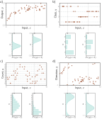

Predicting distributions over outputs. a) Regression task, where the
goal is to predict a real-valued output y from the input x based on training data
{xi, yi} (orange points). For each input value x, the machine learning model predicts
a distribution Pr(y|x) over the output y ∈ R (cyan curves show distributions
for x=2.0 and x=7.0). Minimizing the loss function corresponds to maximizing
the probability of the training outputs yi under the distribution predicted from
the corresponding inputs xi. b) To predict discrete classes y ∈ {1, 2, 3, 4} in a
classification task, we use a discrete probability distribution, so the model predicts
a different histogram over the four possible values of yi for each value of
xi. c) To predict counts y ∈ {0, 1, 2, . . .} and d) direction y ∈ (−π, π], we use
distributions defined over positive integers and circular domains, respectively.

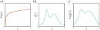

The log transform. a) The log function is monotonically increasing.
If z >z
′, then log[z]>log[z
′
]. It follows that the maximum of any function g[z]
will be at the same position as the maximum of log[g[z]]. b) A function g[z]. c)
The logarithm of this function log[g[z]]. All positions on g[z] with a positive slope
retain a positive slope after the log transform, and those with a negative slope
retain a negative slope. The position of the maximum remains the same.

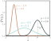

The univariate normal distribution
(also known as the Gaussian distribution)
is defined on the real line z ∈
R and has parameters μ and σ2. The
mean μ determines the position of the
peak. The positive root of the variance
σ2 (the standard deviation) determines
the width of the distribution.
Since the total probability density sums
to one, the peak becomes higher as the
variance decreases and the distribution
becomes narrower.

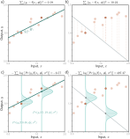

Equivalence of least squares and maximum likelihood loss for the
normal distribution. a) Consider the linear model from figure 2.2. The least
squares criterion minimizes the sum of the squares of the deviations (dashed lines)
between the model prediction f[xi,ϕ] (green line) and the true output values yi
(orange points). Here the fit is good, so these deviations are small (e.g., for the
two highlighted points). b) For these parameters, the fit is bad, and the squared
deviations are large. c) The least squares criterion follows from the assumption
that the model predicts the mean of a normal distribution over the outputs and
that we maximize the probability. For the first case, the model fits well, so the
probability Pr(yi|xi) of the data (horizontal orange dashed lines) is large (and
the negative log probability is small). d) For the second case, the model fits badly,
so the probability is small and the negative log probability is large.

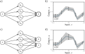

Homoscedastic vs. heteroscedastic regression. a) A shallow neural
network for homoscedastic regression predicts just the mean μ of the output
distribution from the input x. b) The result is that while the mean (blue line)
is a piecewise linear function of the input x, the variance is constant everywhere
(arrows and gray region show ±2 standard deviations). c) A shallow neural
network for heteroscedastic regression also predicts the variance σ2 (or, more
precisely, computes its square root, which we then square). d) The standard
deviation now also becomes a piecewise linear function of the input x.

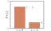

Bernoulli distribution. The
Bernoulli distribution is defined on the
domain z ∈ {0, 1} and has a single parameter
λ that denotes the probability
of observing z = 1. It follows that the
probability of observing z = 0 is 1 − λ.

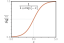

Logistic sigmoid function.
This function maps the real line z ∈
R to numbers between zero and one,
so sig[z] ∈ [0, 1]. An input of 0 is mapped
to 0.5. Negative inputs are mapped to
numbers below 0.5, and positive inputs
to numbers above 0.5.

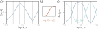

Binary classification model. a) The network output is a piecewise
linear function that can take arbitrary real values. b) This is transformed by the
logistic sigmoid function, which compresses these values to the range [0, 1]. c)
The transformed output predicts the probability λ that y = 1 (solid line). The
probability that y = 0 is hence 1 − λ (dashed line). For any fixed x (vertical
slice), we retrieve the two values of a Bernoulli distribution similar to that in
figure 5.6. The loss function favors model parameters that produce large values
of λ at positions xi that are associated with positive examples yi = 1 and small
values of λ at positions associated with negative examples yi = 0.

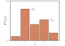

Categorical distribution. The
categorical distribution assigns probabilities
to K>2 categories, with associated
probabilities λ1, λ2, . . . , λK. Here, there
are five categories, so K = 5. To ensure
that this is a valid probability distribution,
each parameter λk must lie in the
range [0, 1], and all K parameters must
sum to one.

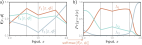

Multiclass classification for K=3 classes. a) The network has three
piecewise linear outputs, which can take arbitrary values. b) After the softmax
function, these outputs are constrained to be non-negative and sum to one. Hence,
for a given input x, we compute valid parameters for the categorical distribution:
any vertical slice of this plot produces three values that sum to one and would
form the heights of the bars in a categorical distribution similar to figure 5.9.

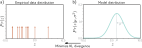

Cross-entropy method. a) Empirical distribution of training samples
(arrows denote Dirac delta functions). b) Model distribution (a normal distribution
with parameters θ = {μ, σ2}). In the cross-entropy approach, we minimize
the distance (KL divergence) between these two distributions as a function of the
model parameters θ.

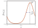

The von Mises distribution
is defined over the circular domain
(−π, π]. It has two parameters.
The mean μ determines the position
of the peak. The concentration κ >
0 acts like the inverse of the variance.
Hence 1/
√
κ is roughly equivalent
to the standard deviation in a normal
distribution.

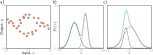

Multimodal data and mixture of Gaussians density. a) Example
training data where, for intermediate values of the input x, the corresponding
output y follows one of two paths. For example, at x = 0, the output y might
be roughly −2 or +3 but is unlikely to be between these values. b) The mixture
of Gaussians is a probability model suited to this kind of data. As the name
suggests, the model is a weighted sum (solid cyan curve) of two or more normal
distributions with different means and variances (here, two normal distributions,
dashed blue and orange curves). When the means are far apart, this forms a
multimodal distribution. c) When the means are close, the mixture can model
unimodal but non-normal densities.

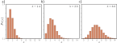

Poisson distribution. This discrete distribution is defined over nonnegative
integers z ∈ {0, 1, 2, . . .}. It has a single parameter λ ∈ R+, which is
known as the rate and is the mean of the distribution. a–c) Poisson distributions
with rates of 1.4, 2.8, and 6.0, respectively.

## Least Squares 

## Negative Log-Likelihood

## Cross-Entropy

\begin{eqnarray}\label{eq:loss_max_like1}
  \hat{\boldsymbol\phi} &=& \mathop{\rm argmax}_{\boldsymbol\phi}\left[\prod_{i=1}^{I} Pr(\mathbf{y}_{i}|\mathbf{x}_{i})\right]\nonumber\\
  &=& \mathop{\rm argmax}_{\boldsymbol\phi}\left[\prod_{i=1}^{I} Pr(\mathbf{y}_{i}|\boldsymbol\theta_{i})\right] \nonumber \\ &=& \mathop{\rm argmax}_{\boldsymbol\phi}\left[\prod_{i=1}^{I} Pr(\mathbf{y}_{i}|\mbox{\bf f}[\mathbf{x}_{i},\boldsymbol\phi])\right].
 \end{eqnarray}

\begin{eqnarray}
  Pr(\mathbf{y}_{1},\mathbf{y}_{2},\ldots, \mathbf{y}_{I}|\mathbf{x}_{1},\mathbf{x}_{2},\ldots,\mathbf{x}_{I}) = \prod_{i=1}^{I} Pr(\mathbf{y}_{i}|\mathbf{x}_{i}).
 \end{eqnarray}

\begin{eqnarray}\label{eq:loss_max_like2}
  \hat{\boldsymbol\phi} &=& \mathop{\rm argmax}_{\boldsymbol\phi}\left[\prod_{i=1}^{I} Pr(\mathbf{y}_{i}|\mbox{\bf f}[\mathbf{x}_{i},\boldsymbol\phi])\right] \nonumber \\
  &=& \mathop{\rm argmax}_{\boldsymbol\phi}\left[\log\left[\prod_{i=1}^{I} Pr(\mathbf{y}_{i}|\mbox{\bf f}[\mathbf{x}_{i},\boldsymbol\phi])\right]\right]\nonumber \\
  &=& \mathop{\rm argmax}_{\boldsymbol\phi}\left[\sum_{i=1}^{I} \log\Bigl[Pr(\mathbf{y}_{i}|\mbox{\bf f}[\mathbf{x}_{i},\boldsymbol\phi])\Bigr]\right].
 \end{eqnarray}

\begin{eqnarray}
 \hat{\boldsymbol\phi} 
 &=& \mathop{\rm argmin}_{\boldsymbol\phi}\left[-\sum_{i=1}^{I} \log\Bigl[Pr(\mathbf{y}_{i}|\mbox{\bf f}[\mathbf{x}_{i},\boldsymbol\phi])\Bigr]\right]\nonumber \\
 &=& \mathop{\rm argmin}_{\boldsymbol\phi}\Bigl[L[\boldsymbol\phi]\Bigr],
 \end{eqnarray}

\begin{eqnarray}
  \hat{\mathbf{y}} = \mathop{\rm argmax}_{\mathbf{y}}\Bigl[Pr(\mathbf{y}|\mbox{\bf f}[\mathbf{x},\hat{\boldsymbol\phi}])\Bigr].
 \end{eqnarray}

\begin{eqnarray}
  \hat{\boldsymbol\phi} = \mathop{\rm argmin}_{\boldsymbol\phi}\Bigl[L[\boldsymbol\phi]\Bigr] = \mathop{\rm argmin}_{\boldsymbol\phi}\left[-\sum_{i=1}^{I} \log\Bigl[Pr(\mathbf{y}_{i}|\mbox{\bf f}[\mathbf{x}_{i},\boldsymbol\phi])\Bigr]\right].
  \end{eqnarray}

\begin{eqnarray}
  Pr(y|\mu,\sigma^2) = \frac{1}{\sqrt{2\pi\sigma^{2}}}\exp\left[-\frac{(y-\mu)^{2}}{2\sigma^{2}}\right].
 \end{eqnarray}

\begin{eqnarray}\label{eq:loss_pdf_uni_reg}
  Pr(y|\mbox{f}[\mathbf{x},\boldsymbol\phi],\sigma^2) = \frac{1}{\sqrt{2\pi\sigma^{2}}}\exp\left[-\frac{(y-\mbox{f}[\mathbf{x},\boldsymbol\phi])^{2}}{2\sigma^{2}}\right].
 \end{eqnarray}

\begin{eqnarray}\label{eq:loss_normal_full}
 L[\boldsymbol\phi] &=& -\sum_{i=1}^{I} \log\left[Pr(y_{i}|\mbox{f}[\mathbf{x}_{i},\boldsymbol\phi],\sigma^{2})\right]\nonumber \\
 &=&-\sum_{i=1}^{I} \log\left[\frac{1}{\sqrt{2\pi\sigma^{2}}}\exp\left[-\frac{(y_i-\mbox{f}[\mathbf{x}_i,\boldsymbol\phi])^{2}}{2\sigma^{2}}\right]\right].
 \end{eqnarray}

\begin{eqnarray}\label{eq:loss_normal_full2}
 \hat{\boldsymbol\phi} &=& \mathop{\rm argmin}_{\boldsymbol\phi}\left[-\sum_{i=1}^{I} \log\left[\frac{1}{\sqrt{2\pi\sigma^{2}}}\exp\left[-\frac{(y_i-\mbox{f}[\mathbf{x}_i,\boldsymbol\phi])^{2}}{2\sigma^{2}}\right]\right]\right]
 \nonumber \\
 &=&\mathop{\rm argmin}_{\boldsymbol\phi}\left[-\sum_{i=1}^{I} \left(\log\left[\frac{1}{\sqrt{2\pi\sigma^{2}}}\right] -\frac{(y_i-\mbox{f}[\mathbf{x}_i,\boldsymbol\phi])^{2}}{2\sigma^{2}}\right)\right]\nonumber \\
 &=& \mathop{\rm argmin}_{\boldsymbol\phi}\left[-\sum_{i=1}^{I} -\frac{(y_i-\mbox{f}[\mathbf{x}_i,\boldsymbol\phi])^{2}}{2\sigma^{2}}\right]\nonumber \\
 &=& \mathop{\rm argmin}_{\boldsymbol\phi}\left[\sum_{i=1}^{I} (y_i-\mbox{f}[\mathbf{x}_i,\boldsymbol\phi])^{2}\right],
 \end{eqnarray}

\begin{eqnarray}\label{eq:loss_least_squares}
  L[\boldsymbol\phi] = \sum_{i=1}^{I} \bigl(y_i-\mbox{f}[\mathbf{x}_i,\boldsymbol\phi]\bigr)^{2}.
 \end{eqnarray}

\begin{eqnarray}
  \hat{y} = \mathop{\rm argmax}_{y}\left[Pr(y|\mbox{f}[\mathbf{x},\hat{\boldsymbol\phi}],\sigma^2)\right].
 \end{eqnarray}

\begin{eqnarray}
 \hat{\boldsymbol\phi},\hat{\sigma}^{2} = \mathop{\rm argmin}_{\boldsymbol\phi,\sigma^{2}}\left[-\sum_{i=1}^{I} \log\left[\frac{1}{\sqrt{2\pi\sigma^{2}}}\exp\left[-\frac{(y_i-\mbox{f}[\mathbf{x}_i,\boldsymbol\phi])^{2}}{2\sigma^{2}}\right]\right]\right].
 \end{eqnarray}

\begin{eqnarray}
 \mu &=& \mbox{f}_1[\mathbf{x},\boldsymbol\phi] \nonumber \\
 \sigma^2 &=& \mbox{f}_2[\mathbf{x},\boldsymbol\phi]^2,
 \end{eqnarray}

\begin{eqnarray}
 \hat{\boldsymbol\phi} = \mathop{\rm argmin}_{\boldsymbol\phi}\left[-\sum_{i=1}^{I} \biggl(\log\left[\frac{1}{\sqrt{2\pi\mbox{f}_2[\mathbf{x}_i,\boldsymbol\phi]^2}}\right] -\frac{(y_i-\mbox{f}_1[\mathbf{x}_i,\boldsymbol\phi])^{2}}{2\mbox{f}_2[\mathbf{x}_i,\boldsymbol\phi]^2}\biggr)\right].
 \end{eqnarray}

\begin{eqnarray}
  Pr(y|\lambda) = \begin{cases} 1-\lambda & \quad y =0 \\ \lambda & \quad y= 1\end{cases},
 \end{eqnarray}

\begin{eqnarray}
  Pr(y|\lambda) = (1-\lambda)^{1-y}\cdot \lambda^{y}.
 \end{eqnarray}

\begin{eqnarray}\label{eq:logistic_sigmoid}
  \mbox{sig}[z] = \frac{1}{1+\exp[-z]}.
 \end{eqnarray}

\begin{eqnarray}\label{eq:loss_binary}
  Pr(y|\mathbf{x}) = (1-\mbox{sig}[\mbox{f}[\mathbf{x},\boldsymbol\phi]])^{1-y}\cdot \mbox{sig}[\mbox{f}[\mathbf{x},\boldsymbol\phi]]^y.
 \end{eqnarray}

\begin{eqnarray}\label{eq:loss_binary_cross_entropy}
 L[\boldsymbol\phi] = \sum_{i=1}^{I}-(1-y_{i})\log\Bigl[1-\mbox{sig}[\mbox{f}[\mathbf{x}_i,\boldsymbol\phi]]\Bigr] - y_{i}\log\Bigl[\mbox{sig}[\mbox{f}[\mathbf{x}_i,\boldsymbol\phi]]\Bigr].
 \end{eqnarray}

\begin{eqnarray}
 Pr(y=k) = \lambda_{k}.
 \end{eqnarray}

\begin{eqnarray}
 \mbox{softmax}_{k}[\mathbf{z}] = \frac{\exp[z_{k}]}{\sum_{k'=1}^{K}\exp[z_{k'}]},
 \end{eqnarray}

\begin{eqnarray}
  Pr(y=k|\mathbf{x}) = \mbox{softmax}_{k}\Bigr[\mbox{\bf f}[\mathbf{x},\boldsymbol\phi]\Bigl].
 \end{eqnarray}

\begin{eqnarray}\label{eq:loss_multiclass_class}
  L[\boldsymbol\phi] &=& -\sum_{i=1}^{I}\log\left[\mbox{softmax}_{y_{i}}\Bigl[\mbox{\bf f}\left[\mathbf{x}_i,\boldsymbol\phi\right]\Bigr]\right]\nonumber\\
  &=& -\sum_{i=1}^{I}\left(\mbox{f}_{y_{i}}\left[\mathbf{x}_i,\boldsymbol\phi\right]-\log\left[\sum_{k'=1}^{K}\exp\left[\mbox{ f}_{k'}\left[\mathbf{x}_i,\boldsymbol\phi\right]\right]\right]\right),
 \end{eqnarray}

\begin{eqnarray}\label{eq:loss_multiple}
 Pr(\mathbf{y}|\mbox{\bf f}[\mathbf{x},\boldsymbol\phi])= \prod_{d}Pr(y_{d}|\mbox{\bf f}_d[\mathbf{x},\boldsymbol\phi]),
 \end{eqnarray}

\begin{eqnarray}
 L[\boldsymbol\phi] = -\sum_{i=1}^{I}\log\Bigl[Pr(\mathbf{y}_i|\mbox{\bf f}[\mathbf{x}_{i},\boldsymbol\phi])\Bigr]= -\sum_{i=1}^{I}\sum_{d}\log\Bigl[Pr(y_{id}|\mbox{\bf f}_d[\mathbf{x}_{i},\boldsymbol\phi])\Bigr].
 \end{eqnarray}

\begin{eqnarray}
 D_{KL}\bigl[q||p\bigr] = \int_{-\infty}^{\infty}q(z) \log\bigl[q(z)\bigr]dz - \int_{-\infty}^{\infty}q(z) \log\bigl[p(z)\bigr]dz.
 \end{eqnarray}

\begin{eqnarray}\label{eq:loss_cross_entropy_empirical}
 q(y) = \frac{1}{I} \sum_{i=1}^{I} \delta[y-y_{i}],
 \end{eqnarray}

\begin{eqnarray}
 \hat{\boldsymbol\theta} &=& \mathop{\rm argmin}_{\boldsymbol\theta}\left[ \int_{-\infty}^{\infty}q(y) \log\bigl[q(y)\bigr]dy - \int_{-\infty}^{\infty}q(y) \log\bigl[Pr(y|\boldsymbol\theta)\bigr] dy\right] \nonumber \\
 &=&\mathop{\rm argmin}_{\boldsymbol\theta}\left[- \int_{-\infty}^{\infty}q(y) \log\bigl[Pr(y|\boldsymbol\theta)\bigr] dy\right],
 \end{eqnarray}

\begin{eqnarray}\label{eq:loss_cross_deriv}
 \hat{\boldsymbol\theta} &=& \mathop{\rm argmin}_{\theta}\left[-\int_{-\infty}^{\infty}\left(\frac{1}{I} \sum_{i=1}^{I} \delta[y-y_{i}]\right)\log\bigl[Pr(y|\boldsymbol\theta)\bigr]dy\right] \nonumber\\
 &=&\mathop{\rm argmin}_{\boldsymbol\theta}\left[-\frac{1}{I} \sum_{i=1}^{I} \log\bigl[Pr(y_i|\boldsymbol\theta)\bigr]\right]\nonumber\\
 &=&\mathop{\rm argmin}_{\boldsymbol\theta}\left[-\sum_{i=1}^{I} \log\bigl[Pr(y_i|\boldsymbol\theta)\bigr]\right].
 \end{eqnarray}

\begin{eqnarray}
 \hat{\boldsymbol\phi} = \mathop{\rm argmin}_{\boldsymbol\phi}\left[-\sum_{i=1}^{I} \log\bigl[Pr(y_{i}|\mbox{\bf f}[\mathbf{x}_{i},\boldsymbol\phi])\bigr]\right].
 \end{eqnarray}

\begin{eqnarray}\label{eq:loss_prob_sigmoid}
  \mbox{sig}[z] = \frac{1}{1+\exp[-z]}.
 \end{eqnarray}

\begin{eqnarray}
 L = -(1-y)\log\Bigl[1-\mbox{sig}[\mbox{f}[\mathbf{x},\boldsymbol\phi]]\Bigr] - y\log\Bigl[\mbox{sig}[\mbox{f}[\mathbf{x},\boldsymbol\phi]]\Bigr],
 \end{eqnarray}

\begin{eqnarray}
 Pr(y|\mu,\kappa) = \frac{\exp\bigl[\kappa \cos[y-\mu]\bigr]}{2\pi \cdot \mbox{Bessel}_{0}[\kappa]} , 
 \end{eqnarray}

\begin{eqnarray}
  Pr(y|\lambda,\mu_1,\mu_2,\sigma^2_1,\sigma^2_2) = \frac{\lambda}{\sqrt{2\pi\sigma_1^{2}}}\exp\left[\frac{-(y-\mu_1)^{2}}{2\sigma_1^{2}}\right]+\frac{1-\lambda}{\sqrt{2\pi\sigma_2^{2}}}\exp\left[\frac{-(y-\mu_2)^{2}}{2\sigma_2^{2}}\right],
 \end{eqnarray}

\begin{eqnarray}
  Pr(y=k)=\frac{\lambda^{k}e^{-\lambda}}{k!}. 
 \end{eqnarray}
