# Performance

::: {.callout-tip}
## Slides
[Slides](https://docs.google.com/presentation/d/1hRlve2y5AhwnZcYESPKUuiQHJkqkJhMCppidV3rnoLQ/edit?slide=id.g3415f9e1348_0_0#slide=id.g3415f9e1348_0_0)
::: 

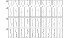

MNIST-1D. a) Templates for 10 classes y ∈ {0, . . . , 9}, based on digits
0–9. b) Training examples x are created by randomly transforming a template
and c) adding noise. d) The horizontal offset of the transformed template is then
sampled at 40 vertical positions. Adapted from (Greydanus, 2020)

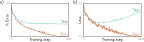

MNIST-1D results. a) Percent classification error as a function of the
training step. The training set errors decrease to zero, but the test errors do not
drop below ∼ 40%. This model doesn’t generalize well to new test data. b) Loss
as a function of the training step. The training loss decreases steadily toward
zero. The test loss decreases at first but subsequently increases as the model
becomes increasingly confident about its (wrong) predictions.

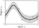

Regression function. Solid
black line shows ground truth function.
To generate I training examples {xi, yi},
the input space x ∈ [0, 1] is divided
into I equal segments and one sample xi
is drawn from a uniform distribution
within each segment. The corresponding
value yi is created by evaluating the
function at xi and adding Gaussian noise
(gray region shows ±2 standard deviations).
The test data are generated in
the same way.

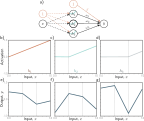

Simplified neural network with three hidden units. a) The weights and
biases between the input and hidden layer are fixed (dashed arrows). b–d) They
are chosen so that the hidden unit activations have slope one, and their joints are
equally spaced across the interval, with joints at x = 0, x = 1/3, and x = 2/3,
respectively. Modifying the remaining parameters ϕ = {β, ω1, ω2, ω3} can create
any piecewise linear function over x ∈ [0, 1] with joints at 1/3 and 2/3. e–g)
Three example functions with different values of the parameters ϕ.

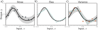

Sources of test error. a) Noise. Data generation is noisy, so even if the
model exactly replicates the true underlying function (black line), the noise in the
test data (gray points) means that some error will remain (gray region represents
two standard deviations). b) Bias. Even with the best possible parameters, the
three-region model (cyan line) cannot exactly fit the true function (black line).
This bias is another source of error (gray regions represent signed error). c)
Variance. In practice, we have limited noisy training data (orange points). When
we fit the model, we don’t recover the best possible function from panel (b) but
a slightly different function (cyan line) that reflects idiosyncrasies of the training
data. This provides an additional source of error (gray region represents two
standard deviations). Figure 8.6 shows how this region was calculated.

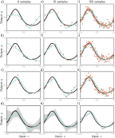

Reducing variance by increasing training data. a–c) The three-region
model fitted to three different randomly sampled datasets of six points. The
fitted model is quite different each time. d) We repeat this experiment many
times and plot the mean model predictions (cyan line) and the variance of the
model predictions (gray area shows two standard deviations). e–h) We do the
same experiment, but this time with datasets of size ten. The variance of the
predictions is reduced. i–l) We repeat this experiment with datasets of size 100.
Now the fitted model is always similar, and the variance is small.

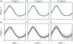

Bias and variance as a function of model capacity. a–c) As we increase
the number of hidden units of the toy model, the number of linear regions
increases, and the model becomes able to fit the true function closely; the bias
(gray region) decreases. d–f) Unfortunately, increasing the model capacity has
the side-effect of increasing the variance term (gray region). This is known as the
bias-variance trade-off.

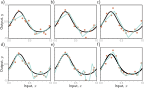

Overfitting. a–c) A model with three regions is fit to three different
datasets of fifteen points each. The result is similar in all three cases (i.e., the
variance is low). d–f) A model with ten regions is fit to the same datasets. The
additional flexibility does not necessarily produce better predictions. While these
three models each describe the training data better, they are not necessarily closer
to the true underlying function (black curve). Instead, they overfit the data and
describe the noise, and the variance (difference between fitted curves) is larger.

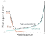

Bias-variance trade-off. The
bias and variance terms from equation
8.7 are plotted as a function of
the model capacity (number of hidden
units / linear regions in range of data)
in the simplified model using training
data from figure 8.8. As the capacity
increases, the bias (solid orange line) decreases,
but the variance (solid cyan line)
increases. The sum of these two terms
(dashed gray line) is minimized when the
capacity is four.

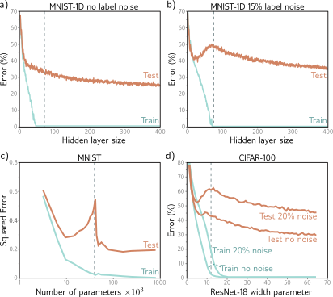

Double descent. a) Training and test error on MNIST-1D for a
two-hidden layer network as we increase the number of hidden units (and hence
parameters) in each layer. The training error decreases to zero as the number of
parameters approaches the number of training examples (vertical dashed line).
The test error does not show the expected bias-variance trade-off but continues
to decrease even after the model has memorized the dataset. b) The same experiment
is repeated with noisier training data. Again, the training error reduces
to zero, although it now takes almost as many parameters as training points to
memorize the dataset. The test error shows the predicted bias/variance trade-off;
it decreases as the capacity increases but then increases again as we near the
point where the training data is exactly memorized. However, it subsequently
decreases again and ultimately reaches a better performance level. This is known
as double descent. Depending on the loss function, the model, and the amount
of noise in the data, the double descent pattern can be seen to a greater or lesser
degree across many datasets. c) Results on MNIST (without label noise) with
shallow neural network from Belkin et al. (2019). d) Results on CIFAR-100 with
ResNet18 network (see chapter 11) from Nakkiran et al. (2021). See original
papers for details.

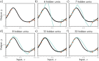

Increasing capacity (hidden units) allows smoother interpolation between
sparse data points. a) Consider this situation where the training data
(orange circles) are sparse; there is a large region in the center with no data examples
to constrain the model to mimic the true function (black curve). b) If we
fit a model with just enough capacity to fit the training data (cyan curve), then it
has to contort itself to pass through the training data, and the output predictions
will not be smooth. c–f) However, as we add more hidden units, the model has
the ability to interpolate between the points more smoothly (smoothest possible
curve plotted in each case). However, unlike in this figure, it is not obliged to.

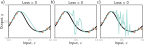

Regularization. a–c) Each of the three fitted curves passes through
the data points exactly, so the training loss for each is zero. However, we might
expect the smooth curve in panel (a) to generalize much better to new data than
the erratic curves in panels (b) and (c). Any factor that biases a model toward
a subset of the solutions with a similar training loss is known as a regularizer.
It is thought that the initialization and/or fitting of neural networks have an
implicit regularizing effect. Consequently, in the over-parameterized regime, more
reasonable solutions, such as that in panel (a), are encouraged.

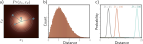

Typical sets. a) Standard normal distribution in two dimensions.
Circles are four samples from this distribution. As the distance from the center
increases, the probability decreases, but the volume of space at that radius
(i.e., the area between adjacent evenly spaced circles) increases. b) These factors
trade off so that the histogram of distances of samples from the center has
a pronounced peak. c) In higher dimensions, this effect becomes more extreme,
and the probability of observing a sample close to the mean becomes vanishingly
small. Although the most likely point is at the mean of the distribution, the
typical samples are found in a relatively narrow shell.

\begin{eqnarray}
  \mu[x] = \mathbb{E}_{y}[y[x]] = \int y[x] Pr(y|x) dy,
 \end{eqnarray}

\begin{eqnarray}
  L[x] &=& \bigl(\mbox{f}[x,\boldsymbol\phi]-y[x]\bigr)^2 \\
  &=& \Bigl(\bigl(\mbox{f}[x,\boldsymbol\phi]-\mu[x]\bigr)+\bigl(\mu[x]-y[x]\bigr)\Bigr)^2\nonumber \\
  &=& \bigl(\mbox{f}[x,\boldsymbol\phi]-\mu[x]\bigr)^2 + 2\bigl(\mbox{f}[x,\boldsymbol\phi]-\mu[x]\bigr)\bigl(\mu[x]-y[x]\bigr) + \bigl(\mu[x]-y[x]\bigr)^2,\nonumber
 \end{eqnarray}

\begin{eqnarray}\label{eq:perf_biasvariance_plus_noise}
  \mathbb{E}_{y}\bigl[L[x]\bigr]
  &=&\mathbb{E}_{y}\Bigl[\bigl(\mbox{f}[x,\boldsymbol\phi]\!-\!\mu[x]\bigr)^2+2\bigl(\mbox{f}[x,\boldsymbol\phi]\!-\!\mu[x]\bigr)\bigl(\mu[x]\!-\!y[x]\bigr)+\bigl(\mu[x]\!-\!y[x]\bigr)^2\Bigr]\nonumber \\
  &=& \bigl(\mbox{f}[x,\boldsymbol\phi]\!-\!\mu[x]\bigr)^2+2\bigl(\mbox{f}[x,\boldsymbol\phi]-\mu[x]\bigr)\bigl(\mu[x]\!-\!\mathbb{E}_y\left[y[x]\right]\bigr)+\mathbb{E}_y\left[(\mu[x]\!-\!y[x])^2\right]\nonumber\\ 
  &=&\bigl(\mbox{f}[x,\boldsymbol\phi]\!-\!\mu[x]\bigr)^2+2\bigl(\mbox{f}[x,\boldsymbol\phi]\!-\!\mu[x]\bigr)\cdot 0 +\mathbb{E}_y\left[\bigl(\mu[x]\!-\!y[x]\bigr)^2\right]\nonumber \\
  &=&\bigl(\mbox{f}[x,\boldsymbol\phi]-\mu[x]\bigr)^2+\sigma^{2},
 \end{eqnarray}

\begin{eqnarray}
  \mbox{f}_{\mu}[x] = \mathbb{E}_{\mathcal{D}}\Bigl[ \mbox{f}\bigl[x,\boldsymbol\phi[\mathcal{D}]\bigr] \Bigr].
 \end{eqnarray}

\begin{eqnarray}
  \bigl(\mbox{f}[x,\boldsymbol\phi[\mathcal{D}]]\!-\!\mu[x]\bigr)^2 &&\\
  &&\hspace{-2.5cm}=\Bigl(\bigl(\mbox{f}[x,\boldsymbol\phi[\mathcal{D}]]\!-\! \mbox{f}_{\mu}[x]\bigr)+\bigl( \mbox{f}_{\mu}[x]-\mu[x]\bigr)\Bigr)^2 \nonumber \\ 
  &&\hspace{-2.5cm}=\bigl(\mbox{f}[x,\boldsymbol\phi[\mathcal{D}]]\!-\! \mbox{f}_{\mu}[x]\bigr)^2+2\bigl(\mbox{f}[x,\boldsymbol\phi[\mathcal{D}]]\!-\! \mbox{f}_{\mu}[x]\bigr)\bigl(\mbox{f}_{\mu}[x]\!-\!\mu[x]\bigr)+\bigl(\mbox{f}_{\mu}[x]\!-\!\mu[x]\bigr)^2.\nonumber
 \end{eqnarray}

\begin{eqnarray}\label{eq:perf_bv2}
 \mathbb{E}_{\mathcal{D}}\Bigl[\bigl(\mbox{f}[x,\boldsymbol\phi[\mathcal{D}]]-\mu[x]\bigr)^2\Bigr] = \mathbb{E}_\mathcal{D}\Bigl[\bigl(\mbox{f}[x,\boldsymbol\phi[\mathcal{D}]]- \mbox{f}_{\mu}[x]\bigr)^2\Bigr]+\bigl(\mbox{f}_{\mu}[x]-\mu[x]\bigr)^2,
 \end{eqnarray}

\begin{eqnarray}\label{eq:perf_bias_variance_final}
 \mathbb{E}_{\mathcal{D}}\Bigl[\mathbb{E}_{y}[L[x]]\Bigr] = 
 \begingroup\color{red}
  \underbrace{\color{black}\mystrut{2.0ex}\mathbb{E}_\mathcal{D}\Bigl[\bigl(\mbox{f}[x,\boldsymbol\phi[\mathcal{D}]]- \mbox{f}_{\mu}[x]\bigr)^2\Bigr]}_{\mbox{variance}} 
  \endgroup
 +
 \begingroup\color{red}
  \underbrace{\color{black}\mystrut{2.0ex}\bigl(\mbox{f}_{\mu}[x]\!-\!\mu[x]\bigr)^2}_{\mbox{bias}} 
  \endgroup
 +
 \begingroup\color{red}
  \underbrace{\color{black}\mystrut{2.0ex}\sigma^2.}_{\mbox{noise}} 
  \endgroup
 \end{eqnarray}

\begin{eqnarray}
  \mbox{Vol}[r] = \frac{r^{D}\pi^{D/2}}{\Gamma[D/2+1]},
 \end{eqnarray}