::: {.callout-tip}
## Slides
[Slides](https://docs.google.com/presentation/d/1ClhiFBnehwgFGDzL6nayEdUijLlvo1W_7KlPy5XO_AI/edit)
::: 

## Processing text data 

## Dot-product self-attention

Self-attention as routing. The self-attention mechanism takes N
inputs x1, . . . , xN ∈ RD (here N = 3 and D = 4) and processes each separately
to compute N value vectors. The nth output san[x1, . . . xN] (written as san[x•]
for short) is then computed as a weighted sum of the N value vectors, where the
weights are positive and sum to one. a) Output sa1[x•] is computed as a[x1, x1] =
0.1 times the first value vector, a[x2, x1] = 0.3 times the second value vector,
and a[x3, x1] = 0.6 times the third value vector. b) Output sa2[x•] is computed
in the same way, but this time with weights of 0.5, 0.2, and 0.3. c) The weighting
for output sa3[x•] is different again. Each output can hence be thought of as a
different routing of the N values.

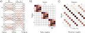

Self-attention for N =3 inputs xn, each with dimension D=4. a) Each
input xm is operated on independently by the same weights Ωv (same color equals
same weight) and biases βv (not shown) to form the values βv + Ωvxm. Each
output is a linear combination of the values, with the attention weight a[xm, xn]
defining the contribution of the mth value to the nth output. b) Matrix showing
block sparsity of linear transformation Ωv between inputs and values. c) Matrix
showing sparsity of attention weights relating values and outputs.

### Computing attention weights

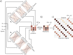

Computing attention weights. a) Query vectors qn = βq + Ωqxn
and key vectors kn = βk + Ωkxn are computed for each input xn. b) The dot
products between each query and the three keys are passed through a softmax
function to form non-negative attentions that sum to one. c) These route the
value vectors (figure 12.1) via the sparse matrix from figure 12.2c.

### Matrix

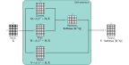

Self-attention in matrix form. Self-attention can be implemented
efficiently if we store the N input vectors xn in the columns of the D×N matrix X.
The input X is operated on separately by the query matrix Q, key matrix K, and
value matrix V. The dot products are then computed using matrix multiplication,
and a softmax operation is applied independently to each column of the resulting
matrix to calculate the attentions. Finally, the values are post-multiplied by the
attentions to create an output of the same size as the input.

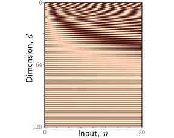

Positional encodings. The
self-attention architecture is equivariant
to permutations of the inputs. To ensure
that inputs at different positions are
treated differently, a positional encoding
matrix Π can be added to the data matrix.
Each column is different, so the positions
can be distinguished. Here, the
position encodings use a predefined procedural
sinusoidal pattern (which can be
extended to larger values of N if necessary).
However, in other cases, they are
learned.

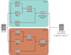

Multi-head self-attention. Self-attention occurs in parallel across
multiple “heads.” Each has its own queries, keys, and values. Here two heads are
depicted, in the cyan and orange boxes, respectively. The outputs are vertically
concatenated, and another linear transformation Ωc is used to recombine them.

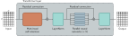

Transformer layer. The input consists of a D × N matrix containing
the D-dimensional word embeddings for each of the N input tokens. The output is
a matrix of the same size. The transformer layer consists of a series of operations.
First, there is a multi-head attention block, allowing the word embeddings to
interact with one another. This forms the processing of a residual block, so the
inputs are added back to the output. Second, a LayerNorm operation is applied
separately to each embedding. Third, there is a second residual layer where the
same fully connected neural network is applied separately to each of the N word
representations (columns). Finally, LayerNorm is applied again.

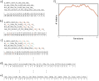

Sub-word tokenization. a) A passage of text from a nursery rhyme.
The tokens are initially just the characters and whitespace (represented by an
underscore), and their frequencies are displayed in the table. b) At each iteration,
the sub-word tokenizer looks for the most commonly occurring adjacent pair of
tokens (in this case, se) and merges them. This creates a new token and decreases
the counts for the original tokens s and e. Note that the last character of the first
token to be merged cannot be whitespace, which prevents merging across words.
c) At the second iteration, the algorithm merges e and the whitespace character_.
d) After 23 iterations, the tokens consist of a mix of letters, word fragments, and
commonly occurring words. e) If we continue this process indefinitely, the tokens
eventually represent the full words. f) Over time, the number of tokens increases
as we add word fragments to the letters and then decreases again as we merge
these fragments. In a real situation, there would be a very large number of words,
and the algorithm would terminate when the vocabulary size (number of tokens)
reached a predetermined value. Punctuation and capital letters would also be
treated as separate input characters.

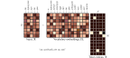

The input embedding matrix X ∈ RD×N contains N embeddings of
length D and is created by multiplying a matrix Ωe containing the embeddings
for the entire vocabulary with a matrix containing one-hot vectors in its columns
that correspond to the word or sub-word indices. The vocabulary matrix Ωe is
considered a parameter of the model and is learned along with the other parameters.
Note that the two embeddings for the word an in X are the same.

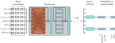

Pre-training for BERT-like encoder. The input tokens (and a special
<cls> token denoting the start of the sequence) are converted to word embeddings.
Here, these are represented as rows rather than columns, so the box
labeled “word embeddings” is XT . These embeddings are passed through a series
of transformer layers (orange connections indicate that every token attends
to every other token in these layers) to create a set of output embeddings. A
small fraction of the input tokens are randomly replaced with a generic <mask>
token. In pre-training, the goal is to predict the missing word from the associated
output embedding. To this end, the outputs corresponding to the masked tokens
are passed through softmax functions, and a multiclass classification loss (section
5.24) is applied to each. This task has the advantage that it uses both the
left and right context to predict the missing word but has the disadvantage that
it does not make efficient use of data; here, seven tokens need to be processed to
add two terms to the loss function.

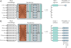

After pre-training, the encoder is fine-tuned using manually labeled
data to solve a particular task. Usually, a linear transformation or a multi-layer
perceptron (MLP) is appended to the encoder to produce whatever output is
required. a) Example text classification task. In this sentiment classification
task, the <cls> token embedding is used to predict the probability that the
review is positive. b) Example word classification task. In this named entity
recognition problem, the embedding for each word is used to predict whether the
word corresponds to a person, place, or organization, or is not an entity.

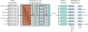

Training GPT3-type decoder network. The tokens are mapped to
word embeddings with a special <start> token at the beginning of the sequence.
The embeddings are passed through a series of transformer layers that use masked
self-attention. Here, each position in the sentence can only attend to its own
embedding and those of tokens earlier in the sequence (orange connections). The
goal at each position is to maximize the probability of the following ground truth
token in the sequence. In other words, at position one, we want to maximize the
probability of the token It; at position two, we want to maximize the probability
of the token takes; and so on. Masked self-attention ensures the system cannot
cheat by looking at subsequent inputs. The autoregressive task has the advantage
of making efficient use of the data since every word contributes a term to the loss
function. However, it only exploits the left context of each word.

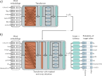

Encoder-decoder architecture. Two sentences are passed to the
system with the goal of translating the first into the second. a) The first sentence
is passed through a standard encoder. b) The second sentence is passed through a
decoder that uses masked self-attention but also attends to the output embeddings
of the encoder using cross-attention (orange rectangle). The loss function is the
same as for the decoder model; we want to maximize the probability of the next
word in the output sequence.

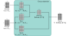

Cross-attention. The flow of computation is the same as in standard
self-attention, but the queries are calculated from the decoder embeddings Xdec,
and the keys and values from the encoder embeddings Xenc. For translation
tasks, the encoder contains information about the source language statistics, and
the decoder contains information about the target language statistics.

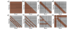

Interaction matrices for self-attention. a) In an encoder, every token
interacts with every other token, and computation expands quadratically with the
number of tokens. b) In a decoder, each token only interacts with the previous
tokens, but complexity is still quadratic. c) Complexity can be reduced by using
a convolutional structure (encoder case). d) Convolutional structure for decoder
case. e–f) Convolutional structure with dilation rate of two and three (decoder
case). g) Another strategy is to allow selected tokens to interact with all the
other tokens (encoder case) or all the previous tokens (decoder case pictured).
h) Alternatively, global tokens can be introduced (left two columns and top two
rows). These interact with all of the tokens as well as with each other.

ImageGPT. a) Images generated from the autoregressive ImageGPT
model. The top-left pixel is drawn from the estimated empirical distribution at
this position. Subsequent pixels are generated in turn, conditioned on the previous
ones, working along the rows until the bottom-right of the image is reached. For
each pixel, the transformer decoder generates a conditional distribution as in
equation 12.15, and a sample is drawn. The extended sequence is then fed back
into the network to generate the next pixel, and so on. b) Image completion.
In each case, the lower half of the image is removed (top row), and ImageGPT
completes the remaining part pixel by pixel (three different completions shown).
Adapted from https://openai.com/blog/image-gpt/.

Vision transformer. The Vision Transformer (ViT) breaks the image
into a grid of patches (16×16 in the original implementation). Each of these
is projected via a learned linear transformation to become a patch embedding.
These patch embeddings are fed into a transformer encoder network, and the
<cls> token is used to predict the class probabilities.

Shifted window (SWin) transformer (Liu et al., 2021c). a) Original
image. b) The SWin transformer breaks the image into a grid of windows and
each of these windows into a sub-grid of patches. The transformer network applies
self-attention to the patches within each window independently (i.e., patches only
attend to other patches in the same window). c) Each alternate layer shifts the
windows so that the subsets of patches that interact with one another change,
and information can propagate across the whole image. d) After several layers,
the 2×2 blocks of patch representations are concatenated to increase the effective
patch (and window) size. e) Alternate layers use shifted windows at this new lower
resolution. f) Eventually, the resolution is such that there is just a single window,
and the patches span the entire image.

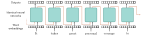

Recurrent neural networks (RNNs). The word embeddings are
passed sequentially through a series of identical neural networks. Each network
has two outputs; one is the output embedding, and the other (orange arrows)
feeds back into the next neural network, along with the next word embedding.
Each output embedding contains information about the word itself and its context
in the preceding sentence fragment. In principle, the final output contains
information about the entire sentence and could be used to support classification
tasks similarly to the <cls> token in a transformer encoder model. However,
RNNs sometimes gradually “forget” about tokens that are further back in time.

\begin{eqnarray}
  \mbox{{\bf f}}[\mathbf{x}] = \mbox{{\bf ReLU}}[\boldsymbol\beta +\boldsymbol\Omega\mathbf{x}],
 \end{eqnarray}

\begin{eqnarray}\label{eq:transformer_values}
  \mathbf{v}_{m} = \boldsymbol\beta_{v}+\boldsymbol\Omega_{v}\mathbf{x}_{m},
 \end{eqnarray}

\begin{eqnarray}\label{eq:transformer_sattention1}
  \mbox{{\bf sa}}_{n}[\mathbf{x}_{1},\ldots, \mathbf{x}_{N}] = \sum_{m=1}^{N}a[\mathbf{x}_{m}, \mathbf{x}_{n}]\mathbf{v}_{m}.
 \end{eqnarray}

\begin{eqnarray}
  \mathbf{q}_{n} &=& \boldsymbol\beta_{q}+\boldsymbol\Omega_{q}\mathbf{x}_{n}\nonumber \\
  \mathbf{k}_{m} &=& \boldsymbol\beta_{k}+\boldsymbol\Omega_{k}\mathbf{x}_{m},
 \end{eqnarray}

\begin{eqnarray}\label{eq:transformer_sattention2}
  a[\mathbf{x}_{m},\mathbf{x}_{n}] &=& \mbox{softmax}_{m}\left[\mathbf{k}_{\bullet}^{T}\mathbf{q}_{n}\right]\nonumber\\
  &=& \frac{\exp\left[\mathbf{k}_{m}^{T}\mathbf{q}_{n}\right]}{\sum_{m'=1}^{N}\exp\left[\mathbf{k}_{m'}^{T}\mathbf{q}_{n} \right]},
 \end{eqnarray}

\begin{eqnarray}
 \mathbf{V}[\mathbf{X}] &=& \boldsymbol\beta_{v}\mathbf{1}^{T}+\boldsymbol\Omega_{\textit{v}}\mathbf{X}\nonumber \\
 \mathbf{Q}[\mathbf{X}] &=& \boldsymbol\beta_{q}\mathbf{1}^{T}+\boldsymbol\Omega_{\textit{q}}\mathbf{X}\nonumber \\
 \mathbf{K}[\mathbf{X}] &=& \boldsymbol\beta_{k}\mathbf{1}^{T}+\boldsymbol\Omega_{\textit{k}}\mathbf{X},
 \end{eqnarray}

\begin{eqnarray}
  \mbox{{\bf Sa}}[\mathbf{X}] =\mathbf{V}[\mathbf{X}]\cdot\mbox{\bf Softmax}\Bigl[\mathbf{K}[\mathbf{X}]^{T}\mathbf{Q}[\mathbf{X}]\Bigr],
 \end{eqnarray}

\begin{eqnarray}\label{eq:transformer_sa_matrix}
  \mbox{{\bf Sa}}[\mathbf{X}] =\mathbf{V}\cdot\mbox{\bf Softmax}\Bigl[\mathbf{K}^{T}\mathbf{Q}\Bigr].
 \end{eqnarray}

\begin{eqnarray}
  \mbox{{\bf Sa}}[\mathbf{X}] =\mathbf{V}\cdot\mbox{\bf Softmax}\left[\frac{\mathbf{K}^{T}\mathbf{Q}}{\sqrt{D}_{q}}\right].
 \end{eqnarray}

\begin{eqnarray}
 \mathbf{V}_h &=& \boldsymbol\beta_{vh}\mathbf{1}^{T}+\boldsymbol\Omega_{\mathit{vh}}\mathbf{X}\nonumber \\
 \mathbf{Q}_h &=& \boldsymbol\beta_{qh}\mathbf{1}^{T}+\boldsymbol\Omega_{\mathit{qh}}\mathbf{X}\nonumber \\
 \mathbf{K}_h &=& \boldsymbol\beta_{kh}\mathbf{1}^{T}+\boldsymbol\Omega_{\mathit{kh}}\mathbf{X}.
 \end{eqnarray}

\begin{eqnarray}
  \mbox{{\bf Sa}}_{h}[\mathbf{X}] =\mathbf{V}_h\cdot\mbox{\bf Softmax}\left[\frac{\mathbf{K}_h^{T}\mathbf{Q}_h}{\sqrt{D}_{q}}\right],
 \end{eqnarray}

\begin{eqnarray}
  \mbox{{\bf MhSa}}[\mathbf{X}] = \boldsymbol\Omega_{c}\Bigl[\mbox{{\bf Sa}}_{1}[\mathbf{X}]^T,\mbox{{\bf Sa}}_{2}[\mathbf{X}]^T,\ldots,\mbox{{\bf Sa}}_{H}[\mathbf{X}]^T \Bigr]^T.
 \end{eqnarray}

\begin{eqnarray}
  \mathbf{X} &\leftarrow& \mathbf{X} + \mbox{\bf{MhSa}}[\mathbf{X}] \nonumber \\
  \mathbf{X} &\leftarrow& \mbox{\bf{LayerNorm}}[\mathbf{X}] \hspace{3cm}\nonumber\\
  \mathbf{x}_{n} &\leftarrow& \mathbf{x}_{n}+\mbox{\bf{mlp}}[\mathbf{x}_{n}] \hspace{3.6cm}\forall\; n\in\{1,\ldots, N\}\nonumber\\
  \mathbf{X} &\leftarrow& \mbox{\bf{LayerNorm}}[\mathbf{X}],
 \end{eqnarray}

\begin{eqnarray}
  Pr(\mbox{\textcolor{red}{It takes great courage to let yourself appear weak}}) &=&\nonumber\\
  &&\hspace{-8cm}Pr(\mbox{\textcolor{red}{It}})\times Pr(\mbox{\textcolor{red}{takes}}|\mbox{\textcolor{red}{It}})\times Pr(\mbox{\textcolor{red}{great}}|\mbox{\textcolor{red}{It takes}})\times Pr(\mbox{\textcolor{red}{courage}}|\mbox{\textcolor{red}{It takes great}})\times\nonumber \\
  &&\hspace{-8cm}Pr(\mbox{\textcolor{red}{to}}|\mbox{\textcolor{red}{It takes great courage}})\times Pr(\mbox{\textcolor{red}{let}}|\mbox{\textcolor{red}{It takes great courage to}})\times\nonumber\\
  &&\hspace{-8cm}Pr(\mbox{\textcolor{red}{yourself}}|\mbox{\textcolor{red}{It takes great courage to let}})\times\nonumber\\
  &&\hspace{-8cm}Pr(\mbox{\textcolor{red}{appear}}|\mbox{\textcolor{red}{It takes great courage to let yourself}})\times\nonumber\\
  &&\hspace{-8cm}Pr(\mbox{\textcolor{red}{weak}}|\mbox{\textcolor{red}{It takes great courage to let yourself appear}}).
 \end{eqnarray}

\begin{eqnarray}\label{eq:transformer_autoregressive}
  Pr(t_{1},t_{2},\ldots, t_{N}) = Pr(t_{1})\prod_{n=2}^{N}Pr(t_{n}|t_{1},\ldots, t_{n-1}).
 \end{eqnarray}

\begin{eqnarray}\label{eq:transformer_position_quad}
  \mbox{{\bf Sa}}[\mathbf{X}] =\mathbf{V}\cdot\mbox{\bf Softmax}\left[\frac{\mathbf{K}^{T}\mathbf{Q}}{\sqrt{D}_{q}}\right],
 \end{eqnarray}

\begin{eqnarray}
 \mathbf{V} &=& \boldsymbol\beta_{v}\mathbf{1}^{T}+\boldsymbol\Omega_{\textit{v}}\mathbf{X}\nonumber \\
 \mathbf{Q} &=& \boldsymbol\beta_{q}\mathbf{1}^{T}+\boldsymbol\Omega_{\textit{q}}(\mathbf{X}+\boldsymbol\Pi)\nonumber \\
 \mathbf{K} &=& \boldsymbol\beta_{k}\mathbf{1}^{T}+\boldsymbol\Omega_{\textit{k}}(\mathbf{X}+\boldsymbol\Pi).
 \end{eqnarray}

\begin{eqnarray}
     \mbox{\bf Sa}[\mathbf{X}\mathbf{P}] = \mbox{\bf Sa}[\mathbf{X}]\mathbf{P}.
 \end{eqnarray}

\begin{eqnarray}
 y_{i} = \mbox{softmax}_{i}[\mathbf{z}] = \frac{\exp[z_{i}]}{\sum_{j=1}^{5}\exp[z_{j}]},
 \end{eqnarray}

\begin{eqnarray}
  a[\mathbf{x}_{m},\mathbf{x}_{n}] = \mbox{softmax}_{m}\left[\mathbf{k}_{\bullet}^T\mathbf{q}_{n}\right]
  = \frac{\exp\left[\mathbf{k}_m^T\mathbf{q}_{n}\right]}{\sum_{m'=1}^{N}\exp\left[\mathbf{k}_{m'}^{T}\mathbf{q}_{n} \right]}.
 \end{eqnarray}