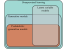

## Taxonomy of unsupervised learning models 

Taxonomy of unsupervised
learning models. Unsupervised learning
refers to any model trained on datasets
without labels. Generative models can
synthesize (generate) new examples with
similar statistics to the training data. A
subset of these are probabilistic and define
a distribution over the data. We
draw samples from this distribution to
generate new examples. Latent variable
models define a mapping between
an underlying explanatory (latent) variable
and the data and may fall into any
of the above categories.

\begin{eqnarray}
  L[\boldsymbol\phi] = -\sum_{i=1}^{I}\log\Bigl[Pr(\mathbf{x}_{i}|\boldsymbol\phi)\Bigr].
 \end{eqnarray}
 
## What makes a good generative model? 

Fitting generative models a) Generative adversarial models provide
a mechanism for generating samples (orange points). As training proceeds (left
to right), the loss function encourages these samples to become progressively less
distinguishable from real examples (cyan points). b) Probabilistic models (including
variational autoencoders, normalizing flows, and diffusion models) learn
a probability distribution over the training data. As training proceeds (left to
right), the likelihood of the real examples increases under this distribution, which
can be used to draw new samples and assess the probability of new data points.

## Quantifying performance

### Test Likelihood

### Inception Score

\begin{eqnarray}
 IS &=& \exp\left[\frac{1}{I}\sum_{i=1}^{I}D_{KL}\Bigl[Pr(y|\mathbf{x}^*_{i})||Pr(y) \Bigr]\right],
 \end{eqnarray}

\begin{eqnarray}
 Pr(y) = \frac{1}{I}\sum_{i=1}^I Pr(y|\mathbf{x}^*_i).
 \end{eqnarray}

### Frechet Inception Distance

### Manifold Precision and Recall

Inception score. a) A pretrained network classifies the generated
images. If the images are realistic, the resulting class probabilities Pr(y|x
∗
i )
should be peaked at the correct class. b) If the model generates all classes equally
frequently, the marginal (average) class probabilities should be flat. The inception
score measures the average distance between the distributions in (a) and the
distribution in (b). Images from Deng et al. (2009).

Manifold precision/recall. a) True distributions of real examples and
samples synthesized by the generative model. b) The overlap can be summarized
by the precision (the proportion of synthesized samples that overlap with the
distribution or manifold of real examples), and c) recall (the proportion of real
examples that overlap with the manifold of the synthesized samples). d) The
manifold of synthesized samples can be approximated by taking the union of a
set of hyperspheres centered on each sample. Here, these have constant radius, but
more commonly, the radius is based on the distance to the kth nearest neighbor.
e) The manifold for real examples is approximated similarly. f) The precision
can be computed as the proportion of samples that lie within the approximated
manifold of real examples. Similarly, the recall is computed as the proportion of
real examples that lie within the approximated manifold of samples (not shown).
Adapted from Kynkäänniemi et al. (2019).
